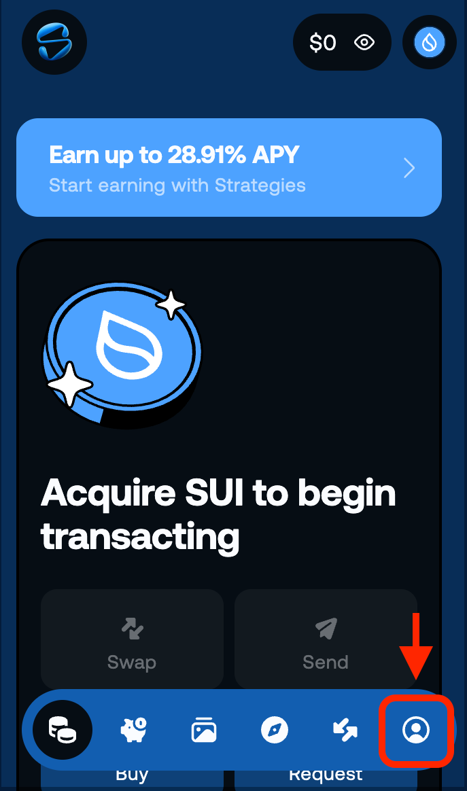
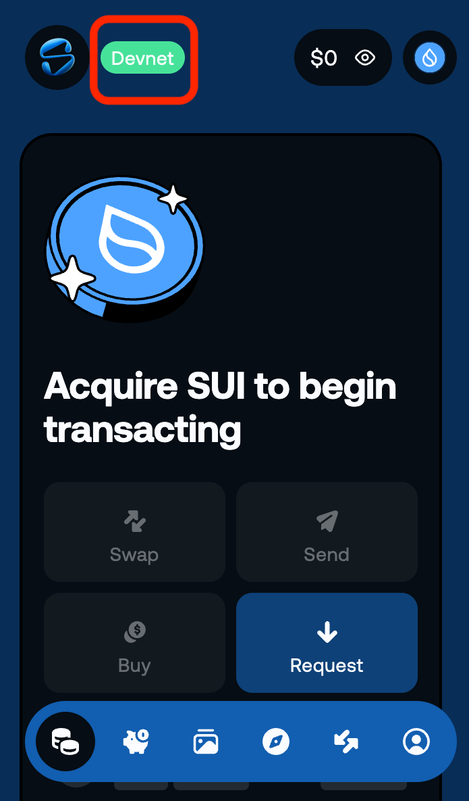

# Switch to Devnet

Once your wallet is ready, let's switch to a development network. This is a quick setup that takes less than 2 minutes.

## What is Devnet?

Sui has multiple networks:

- **Mainnet** — The production environment. Handles real assets.
- **Testnet** — The staging environment. Ideal for pre-production verification and integration testing.
- **Devnet** — The development environment. Ideal for experimenting and iterating freely.

In this tutorial, we'll use **Devnet**. You can get free test SUI tokens on any network.

:::tip Why use Devnet?
Devnet is great for learning because you can easily get test SUI (gas) from the Faucet via Sui CLI. 
(Testnet's Faucet can sometimes have delays due to heavy traffic or rate limiting.) 
Note: Devnet is reset relatively frequently. Use Testnet if you need to preserve work long-term.
:::

---

## Switch to Devnet

Let's switch the network in your Slush wallet.

### 1. Open Settings

1. Click the Slush icon in your browser toolbar to open the wallet 
(enter your password if prompted)

2. Click the user icon at the bottom right to open the "**Settings**" screen

### 2. Select Devnet

1. Click "**Network**"

2. Select "**Devnet**"

---

## Verify Success

Return to the wallet's main screen. If you see "**Devnet**" displayed at the top, you're all set!

---

## What You Did in This Lesson

- [x] Learned about Devnet
- [x] Switched your wallet network to Devnet
- [x] Confirmed the switch to Devnet

