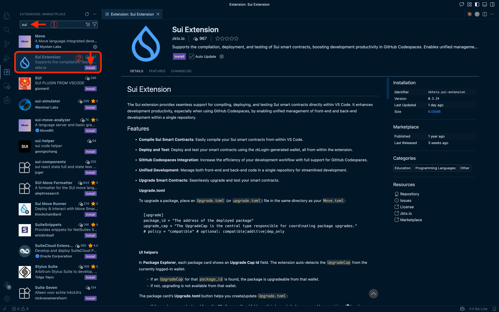

# Install Sui Extension for VSCode

Let's install the **Sui Extension** in VSCode to set up your Move development environment. With this extension, you can compile, deploy, and test contracts—all within VSCode.

It's not difficult. Just install the extension and log in with your Google account (you'll need a Google account, but it's free to use).

## What is Sui Extension?

Sui Extension is a VSCode extension for Sui development, created by [zktx.io](https://zktx.io/).

- **zkLogin Wallet** — Create a wallet with your Google account (Devnet/Testnet supported)
- **Compile, Deploy, Test** — Manage Move projects within VSCode
- **Package Explorer** — View and interact with deployed contracts
- **Object Explorer** — Inspect Sui objects
- **PTB-Builder** — Visually construct transactions
- **Templates** — Start projects quickly with 30+ Move templates

In this tutorial, we'll use Sui Extension to deploy and test contracts.

:::tip Difference from Slush Wallet
The **Slush** wallet you set up in L01-L02 and the **zkLogin wallet** in this extension are separate.

- **Slush** — Use when interacting with dApps in your browser
- **zkLogin (Sui Extension)** — Use when deploying and testing contracts in VSCode

You'll use both during development. Think of it as separating your "user wallet" from your "developer wallet."
:::

---

## Steps

### 1. Install VSCode

If you don't have VSCode yet, download and install it from the [official website](https://code.visualstudio.com/).

If you already have it installed, skip to the next step.

---

### 2. Install Sui Extension

1. **Open VSCode**

2. **Open the Extensions panel**
   - Click the icon with four squares on the left sidebar
   - Or press `Ctrl+Shift+X` (macOS: `Cmd+Shift+X`)

3. **Search for "Sui Extension"**

4. **Find and install "Sui Extension" by zktx.io**
   - Make sure the publisher is "zktx.io"

After installation, you'll see a Sui icon in the activity bar (the vertical icon bar on the left).

---

### 3. Open Sui Extension

1. **Click the Sui icon in the activity bar**

   Click the Sui icon that was added to the activity bar on the left.

2. **Check the panel**

   The Sui Extension panel will appear in the sidebar.

---

### 4. Create a Wallet with zkLogin

1. **Set the network to "Devnet"**

   In the network selector at the top of the panel, choose "Devnet" (the development network).

2. **Click the "Google Login" button**

3. **Authenticate with your Google account**

   A browser window will open. Log in with your Google account.

4. **Verify your wallet address**

   Once authenticated, your wallet address (`0x...`) will appear in the panel.

:::warning Session Expiration
zkLogin wallets have an expiration time. When the session expires, click "Google Login" again to reconnect.
:::

---

## Verify Success

You're all set if you can confirm the following:

- [x] Sui Extension is installed (Sui icon appears in the activity bar)
- [x] Network is set to "Devnet"
- [x] Wallet panel shows your address (`0x...`)

Once you've confirmed these, you're ready to work with Move contracts.

---

## What You Did in This Lesson

- [x] Understood what Sui Extension does
- [x] Installed Sui Extension in VSCode
- [x] Created a wallet with zkLogin
- [x] Connected to Devnet
