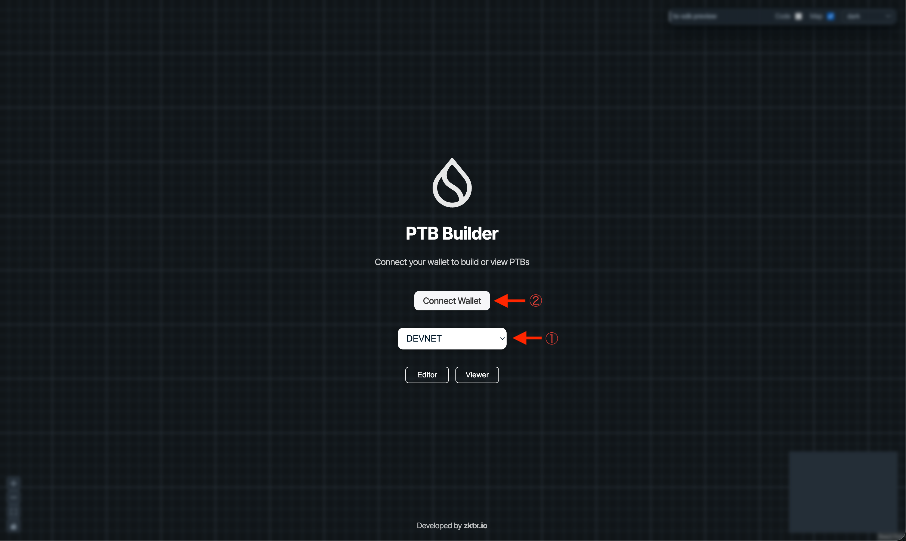
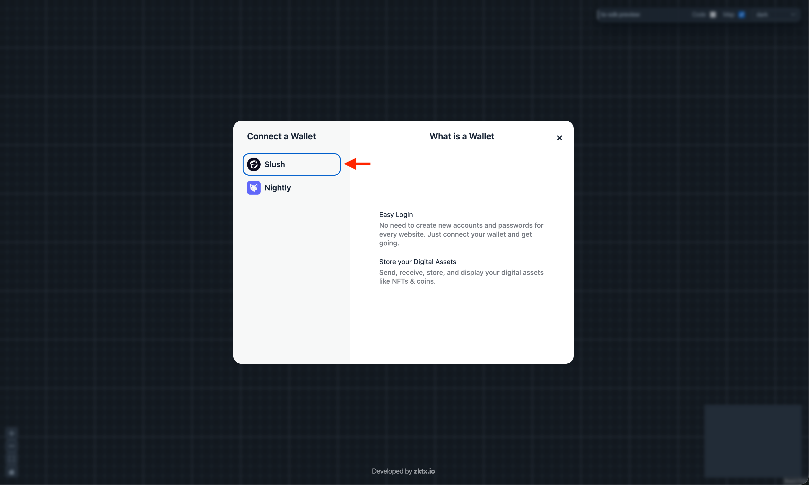

# Connect Wallet to PTB Builder

In this lesson, you'll connect your Slush wallet to PTB Builder. **It's not difficult**—follow the steps and you'll be done in a few minutes.

## What is PTB Builder?

**PTB Builder** is a developer tool that lets you visually build and execute Sui transactions (Programmable Transaction Blocks / PTBs).

Normally, creating transactions requires using the CLI or SDK, but with PTB Builder, you can assemble transactions simply by dragging and dropping blocks.

By connecting your wallet, you can:

- Use your own wallet address
- Sign the transactions you create
- Execute them on the actual blockchain

:::tip Flow of creating transactions with PTB Builder
1. **Connect your wallet** (this lesson)
2. Visually create a transaction
3. Sign and execute
:::

### Two Ways to Use PTB Builder

There are two ways to use PTB Builder:

- **External site ([ptb.wal.app](https://ptb.wal.app/))**
  - Both Editor and Viewer functionality
  - Supports Devnet / Testnet / Mainnet
  - Use when you need full functionality

- **On-site demo ([PTB Builder Demo](/docs/live-code-example/ptb-builder))**
  - Editor functionality only
  - Devnet only
  - Used in future lessons after deploying Move modules

In this lesson, we'll learn wallet connection basics using the external site. In future lessons, we'll primarily use the on-site demo for convenience.

---

## Prerequisites

Before starting this lesson, make sure you have completed the following:

- [Installed Slush wallet](/docs/getting-started/L01-install-slush)
- [Switched to Devnet](/docs/getting-started/L02-switch-devnet)

---

## Steps

### 1. Open PTB Builder

Access PTB Builder from the link below.

→ [PTB Builder (ptb.wal.app)](https://ptb.wal.app/)

### 2. Select the network and click "Connect Wallet"

Select the network you want to use from the dropdown in the center of the screen. 
In this tutorial, select "**DEVNET**" and click the "**Connect Wallet**" button.

:::warning Network must match
Make sure to select the same network as your Slush wallet.
In this tutorial, we use **Devnet** for both.
:::

### 3. Select Slush

The wallet selection screen will appear. 
Select "**Slush**" from the list.

:::note Other wallets
You can also select other Sui-compatible wallets like Sui Wallet, Suiet, or Ethos Wallet.
In this tutorial, we use the **Slush wallet**.
:::

### 4. Approve the connection

A Slush wallet popup will appear.
If prompted, enter your password, select the wallet address you want to connect, and click "**Approve**".

Once connected, the "Connect Wallet" button will change to display your connected wallet address.

### 5. Select Editor / Viewer

There are two buttons at the bottom of the screen. Choose based on your purpose:

- **Editor**: Visually build a new transaction
- **Viewer**: Visually review the flow of executed transactions

---

## Verify Success

If you see the Editor or Viewer screen, your wallet connection is complete.

---

## What you did in this lesson

* [x] Understood what PTB Builder is
* [x] Accessed PTB Builder (ptb.wal.app)
* [x] Set the network to Devnet
* [x] Connected your Slush wallet
* [x] Confirmed successful connection

---

## PTB Builder for Future Lessons

PTB Builder is also embedded in this site.

→ [PTB Builder Demo Page](/docs/live-code-example/ptb-builder)

In future lessons, you'll use this PTB Builder to build and execute transactions **after deploying Move modules**.
You can try it right within the lesson flow without navigating to an external site.

:::note On-site demo limitations
The on-site PTB Builder supports Editor functionality only and Devnet only.
For viewing executed transactions (Viewer) or using other networks, please use [ptb.wal.app](https://ptb.wal.app/).
:::
