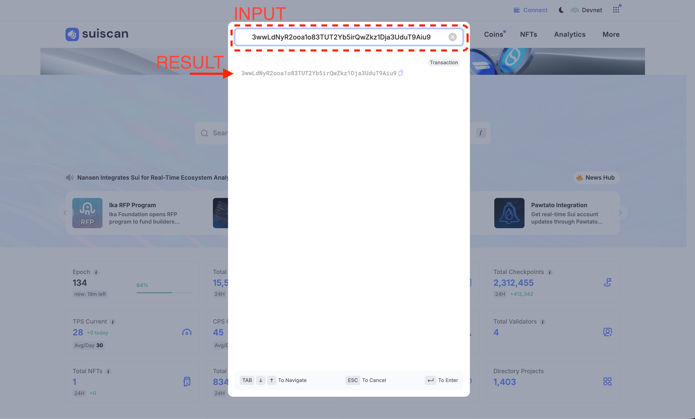
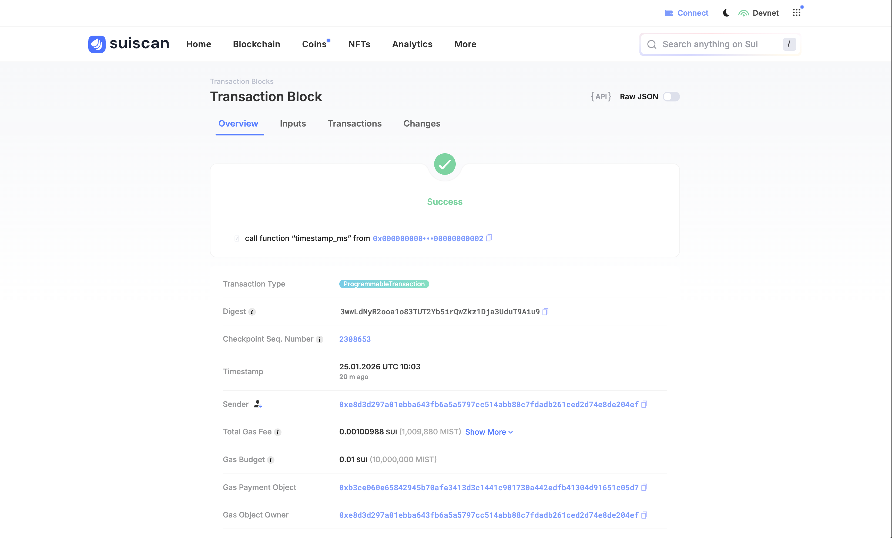

# Read Transaction in Explorer

In this lesson, you'll learn how to view transaction details using a blockchain explorer. Being able to see exactly what happened on-chain is an essential skill for any developer.

:::tip Why use an explorer?
During development, you might encounter situations where "the transaction succeeded but didn't behave as expected."
By checking what actually happened in the explorer, you can identify the root cause of issues.
:::

## What is an Explorer?

A **blockchain explorer** is a tool that lets you search and view all transactions, addresses, and objects on the blockchain.

Sui has several explorers:

- **Suiscan** — [suiscan.xyz](https://suiscan.xyz/)
- **SuiVision** — [suivision.xyz](https://suivision.xyz/)

Both offer the same basic functionality, but **we'll use Suiscan throughout this site**.

With Suiscan, you can:

- View details of transactions you've sent
- Browse transaction history for any address
- Inspect smart contract (Package) contents

---

## Prerequisites

Before starting this lesson, make sure you have:

- Sui CLI installed (verify with `sui --version`)
- CLI connected to Devnet (verify with `sui client active-env` returning `devnet`)
- Test SUI from Faucet (verify with `sui client gas` to check balance)

---

## Steps

### 1. Open Suiscan

Visit Suiscan using the link below.

→ [Suiscan (suiscan.xyz)](https://suiscan.xyz/)

### 2. Switch the Network to Devnet

Select "**Devnet**" from the network dropdown in the top right corner.


:::warning Always verify the network
Mainnet, Testnet, and Devnet are separate blockchains, so you can only find transactions on the network where they were executed. Since we're using Devnet for lessons on this site, make sure to select **Devnet** here.
:::

### 3. Execute a Transaction and Search for It

Let's execute a transaction and view it in Suiscan.

#### Execute a Transaction with CLI

:::danger Verify your network before executing!
If your CLI is connected to **Mainnet**, **real SUI coins** will be consumed as gas fees.

Always verify you're connected to Devnet with this command:
```bash
sui client active-env
```
If it shows `devnet`, you're good to go. If it shows a different network, switch with:
```bash
sui client switch --env devnet
```
:::

Run the following command. This is a simple transaction that reads the current time from Sui's system Clock.

```bash
sui client call \
  --package 0x2 \
  --module clock \
  --function timestamp_ms \
  --args 0x6 \
  --gas-budget 10000000
```

:::info Command explanation
This command calls the `timestamp_ms` function in the `clock` module of Sui's standard library (`0x2` package). It passes the Clock object (`0x6`) as an argument and sets the maximum gas budget to 10,000,000 MIST (= 0.01 SUI).
:::

After running the command, you'll see output like this:

```
Transaction Digest: AbC123xYz...
╭─────────────────────────────────────────────────────────────────────────────────────────────────╮
│ Transaction Data                                                                                │
├─────────────────────────────────────────────────────────────────────────────────────────────────┤
│ ...                                                                                             │
│ ...                                                                                             │
│ ...                                                                                             │

```

The **Transaction Digest** is the unique ID of your transaction. Copy it, click the search box on the Suiscan homepage, paste it into the search field in the modal that appears, and search. This will open the transaction details page.


### 4. Read the Transaction Details

When you open the transaction, you'll see a page like this:



At the top of the page, there are four tabs that jump to different sections:

- **Overview** — Transaction summary (status, sender, gas fees, etc.)
- **Inputs** — Objects used as inputs to the transaction
- **Transactions** — Details of executed operations
- **Changes** — Changes made by the transaction

In **Overview**, you can check the following information:

- **(Status)** — A green checkmark with "Success" means success; a red X with "Failure" means failure
- **(Transaction summary)** — Summary of the executed operation (e.g., `call function "timestamp_ms" from 0x...002`)
- **Transaction Type** — Type of transaction (e.g., `ProgrammableTransaction`)
- **Digest** — Unique transaction ID
- **Timestamp** — Execution date and time
- **Sender** — Address that sent the transaction
- **Total Gas Fee** — Actual gas fee paid (e.g., 0.00100988 SUI)
- **Gas Budget** — Maximum gas limit you set (e.g., 0.01 SUI)
- **Gas Payment Object** — Object used to pay gas (usually a SUI coin)
- **Gas Object Owner** — Address that paid the gas fee
- **User Signature** — Transaction signature (click "Show More" for details)

In **Inputs**, you can see the objects provided as inputs to the transaction. In our example, the Clock object (`0x6`) was used as input.

In **Transactions**, you can see details of the executed operations. For MoveCall operations, you can check the called function's information (package, module, function name, arguments). If there are multiple operations (PTB), they're displayed in execution order.

In **Changes**, you can see objects that were modified by the transaction. In our example, the SUI coin balance was changed due to gas payment.

---

## Verify Your Success

You've completed this lesson if you can:

- [ ] Execute `timestamp_ms` via CLI and obtain the Transaction Digest
- [ ] Search for the Transaction Digest in Suiscan and open the transaction details page
- [ ] Confirm the status shows "Success" in Overview
- [ ] Review the contents of Inputs, Transactions, and Changes sections

---

## Common Issues

### Transaction Not Found

- Verify you're on the correct network (Devnet/Testnet/Mainnet)
- Check that no extra spaces were copied with the Transaction Digest
- It may take a few seconds for the transaction to appear after execution

### Shows as Failed

- If you're out of gas, get more SUI from the Faucet
- Check the error message to identify the cause

---

## What You Did in This Lesson

- [x] Learned the basics of using Suiscan
- [x] Learned how to switch networks
- [x] Learned how to search for transactions
- [x] Understood how to read Overview, Input/Output, and Gas information
