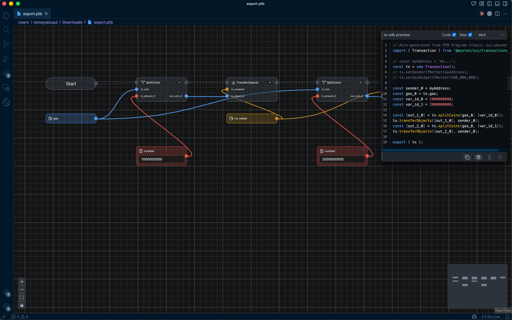

import BrowserOnly from '@docusaurus/BrowserOnly';
import { PtbBuilderDemo } from '@site/src/components/PtbBuilderDemo';

# Generate TS Code with PTB Builder

In this lesson, you'll learn how to **view the TypeScript code** for a PTB you built in PTB Builder, and **export the PTB definition** as a `.ptb` file. It's straightforward — just click a button.

## Why is Export Useful?

PTB Builder is a visual editor that makes it easy to build PTBs intuitively. However, in actual dApp development, you need to **construct transactions in code**.

With the export feature, you can:

- **Build even complex transactions intuitively with the GUI** and output them as code
- **Use it as a starting point** for your implementation
- **Great for learning** — if you're unsure how to write the code, build it in the GUI and export it for reference

---

## Prerequisites

Before starting this lesson, make sure you've completed:

- [L10: Batch Multiple Commands](/docs/learn/beginner/L10-combine-two-operations) (recommended)
- [Sui Extension](/docs/getting-started/L04-vscode-sui-extension) installed in VSCode

:::tip
Even if you haven't completed L10, that's okay. This lesson uses a sample PTB to demonstrate the export feature.
:::

---

## Try Export in PTB Builder

The visual editor below has the PTB from the previous lesson (L10) — a "double transfer combined into one transaction" — pre-loaded.

Follow the **Guide** in the top-left to walk through the export steps.

<BrowserOnly>
  {() => <PtbBuilderDemo templateId="double-transfer" tutorialId="ts-export" />}
</BrowserOnly>

---

## Open the Downloaded .ptb File in VSCode

The exported `.ptb` file is not TypeScript code — it's a **PTB graph definition saved in JSON format**.

With the **Sui Extension** installed in VSCode, opening a `.ptb` file displays the same **PTB Builder UI** as the web version. You can also check the TypeScript code from the ts-sdk preview window in VSCode.

This means you can create a `.ptb` file and **build and edit PTBs directly inside VSCode**.



:::tip
For installation instructions, see [Install Sui Extension in VSCode](/docs/getting-started/L04-vscode-sui-extension).
:::

---

## Check the TS Code

The TypeScript code shown in the ts-sdk preview window has a structure like this:

```typescript
// Auto-generated from PTB Program (chain: sui:devnet)
import { Transaction } from '@mysten/sui/transactions';

const myAddress = '0xe8d3...'; // your connected wallet address
const tx = new Transaction();
tx.setSenderIfNotSet(myAddress);
// tx.setGasBudgetIfNotSet(500_000_000);

const sender_0 = myAddress;
const gas_0 = tx.gas;
const var_id_0 = 1000000000;
const var_id_1 = 2000000000;

const [out_1_0] = tx.splitCoins(gas_0, [var_id_0]);
tx.transferObjects([out_1_0], sender_0);
const [out_2_0] = tx.splitCoins(gas_0, [var_id_1]);
tx.transferObjects([out_2_0], sender_0);

export { tx };
```

:::info Code Explanation
- Import the `Transaction` class and create a new transaction
- `myAddress` holds your connected wallet address
- `gas_0 = tx.gas` references the gas coin, and `splitCoins` splits the specified amount from it
- `transferObjects` sends the split coins to `sender_0` (your own address)
- Four commands (`splitCoins` → `transferObjects` → `splitCoins` → `transferObjects`) are combined into a single PTB
- `export { tx }` exports the transaction object
:::

---

## Success Criteria

You've completed this lesson if you can:

- [ ] Confirm the TypeScript code in the ts-sdk preview window
- [ ] Download the `.ptb` file using the "Export" button
- [ ] Open the `.ptb` file in VSCode + Sui Extension as a PTB Builder

---

## What You Did in This Lesson

- [x] Understood the purpose of the PTB Builder Export feature
- [x] Reviewed the TS code in the ts-sdk preview window
- [x] Clicked the Export button to download the .ptb file
- [x] Opened the `.ptb` file in VSCode + Sui Extension

---

## Next Steps

The exported code will be used in the advanced course. Understanding how the GUI-built content is expressed in code at this stage will deepen your understanding when learning the SDK.
