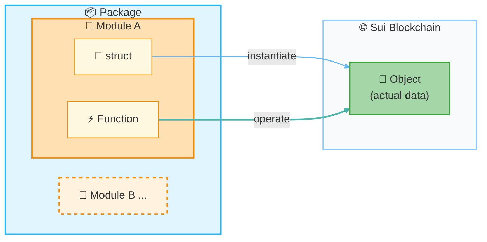

# Learn Move Mechanics

In this lesson, you'll learn three key concepts in Move: **Package**, **Module**, and **Object**. It's not difficult — no coding required. You'll understand everything just by reading the diagrams and sample code.

## Why Learn Move Mechanics?

In the previous lesson, you created a Move project. The next lesson is where you'll start writing real code — but first, understanding Move's basic structure will make everything click into place much faster.

Move has some unique concepts that differ from other programming languages. In particular, the concept of **Object** is the most important mechanism in Sui Move.

---

## How the Three Concepts Relate

Let's start with the big picture — how Package, Module, and Object fit together.



---

## Package

A **Package** is the largest unit that groups your Move code together. The entire folder you created with `sui move new` in the previous lesson is your Package.

### Package Characteristics

- Configuration is managed by the `Move.toml` file
- Contains one or more Modules
- The unit you deploy (publish) to Sui
- Identified by a **Package ID** after publishing

### Inside Move.toml

`Move.toml` is the configuration file for your Package. It describes the package name and its dependencies.

```toml
[package]
name = "my_first_package"
edition = "2024.beta"

[dependencies]
Sui = { git = "https://github.com/MystenLabs/sui.git", subdir = "crates/sui-framework/packages/sui-framework", rev = "framework/testnet" }

[addresses]
my_first_package = "0x0"
```

:::info
The `"0x0"` in the `[addresses]` section is a placeholder used before publishing. When you deploy to Sui, the actual Package ID is assigned as part of the deployment result (Move.toml is not automatically rewritten).
:::

---

## Module

A **Module** is a unit that groups related functionality together. You write Modules in `.move` files inside the `sources/` directory.

### Module Characteristics

- Defines functions and types (structs)
- Conventionally, one `.move` file contains one Module
- Declared using the format `module package_name::module_name`

### Module Example

```move
module my_first_package::counter {
    // Define types and functions used in this Module

    /// A struct (type) representing a counter
    public struct Counter has key, store {
        id: UID,
        value: u64,
    }

    /// A function that increments the counter
    public fun increment(counter: &mut Counter) {
        counter.value = counter.value + 1;
    }
}
```

In this example:
- `my_first_package` is the Package name
- `counter` is the Module name
- `Counter` is the type (struct)
- `increment` is the function

---

## Object

An Object is the most important concept in Sui Move. It's a special data type that represents a **digital asset with ownership** on Sui.

### Why Are Objects Important?

In traditional programming, data can be freely copied or deleted. But imagine if tokens or NFTs on a blockchain could be duplicated — that would be a serious problem.

In Sui Move, Objects have specific restrictions that make digital assets safe:

- **No copying** — Objects cannot be copied (prevents infinite duplication)
- **No arbitrary deletion** — Objects must be explicitly consumed or stored somewhere; you can't just discard them
- **Ownership** — Every Object has an owner

### Controlling Behavior with Abilities

In Move, you give structs **Abilities** to control how they behave.

```move
// key = can exist on-chain as a Sui Object (requires a UID field in Sui)
public struct Counter has key, store {
    id: UID,
    value: u64,
}

// copy + drop = freely copyable and discardable (ordinary data)
public struct Config has copy, drop {
    max_value: u64,
}
```

Main Abilities:

- `key` — Can exist on-chain as a Sui Object (requires a UID field in Sui)
- `store` — The value can be stored inside another Object's field (required in some transfer scenarios)
- `copy` — Can be copied
- `drop` — Can be automatically discarded when no longer in use

:::tip
A struct with `key` but without `copy` and `drop` is a typical Object (digital asset). This is what makes tokens and NFTs secure.
:::

---

## Putting It All Together

Let's look at a complete sample that includes all three concepts.

This code is a simplified version for illustration purposes. To actually run it, you'd need to import modules using `use`.

```move
// Module declaration: PackageName::ModuleName
module my_first_package::counter {

    // === Object Definition ===

    /// Counter Object
    /// key: can exist as a Sui Object
    /// store: can be stored inside another Object
    public struct Counter has key, store {
        id: UID,       // Required for all Sui Objects
        value: u64,    // The counter's value
    }

    // === Function Definitions ===

    /// Creates a new counter and transfers it to the caller
    public fun create(ctx: &mut TxContext) {
        let counter = Counter {
            id: object::new(ctx),
            value: 0,
        };
        transfer::transfer(counter, ctx.sender());
    }

    /// Increments the counter by 1
    public fun increment(counter: &mut Counter) {
        counter.value = counter.value + 1;
    }

    /// Returns the current value
    public fun value(counter: &Counter): u64 {
        counter.value
    }
}
```

Key takeaways from this code:

1. **Package**: This file is part of the `my_first_package` Package
2. **Module**: The `counter` Module groups the functionality together
3. **Object**: The `Counter` struct has `key`, so it exists as a Sui Object with ownership

---

## Summary

- **Package**: The largest unit of code organization. Your entire `my_first_package` folder is a Package.
- **Module**: A unit that groups related functionality. The `counter` module inside `counter.move` is a Module.
- **Object**: A digital asset with ownership. The `Counter` struct with the `key` ability is an Object.

---

## Completion Checklist

You're done with this lesson when you can:

- [ ] Explain the three concepts: Package, Module, and Object
- [ ] Look at sample code and identify which part is the Module declaration and which part is the Object
- [ ] Understand the role of Abilities (`key`, `store`, `copy`, `drop`)

---

## What You Did in This Lesson

- [x] Learned the three core concepts: Package, Module, and Object
- [x] Visualized their relationships through a diagram
- [x] Understood how Abilities control type behavior
- [x] Confirmed how all three concepts appear in sample code

In the next lesson, you'll write a simple smart contract from scratch. The concepts you learned here will be the foundation for everything you write.
