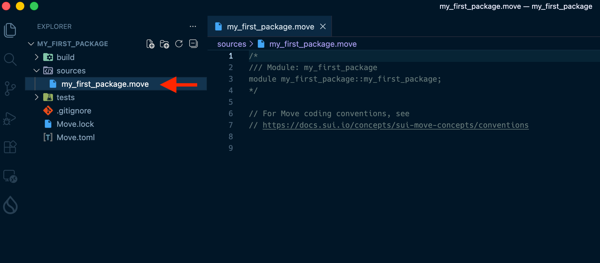
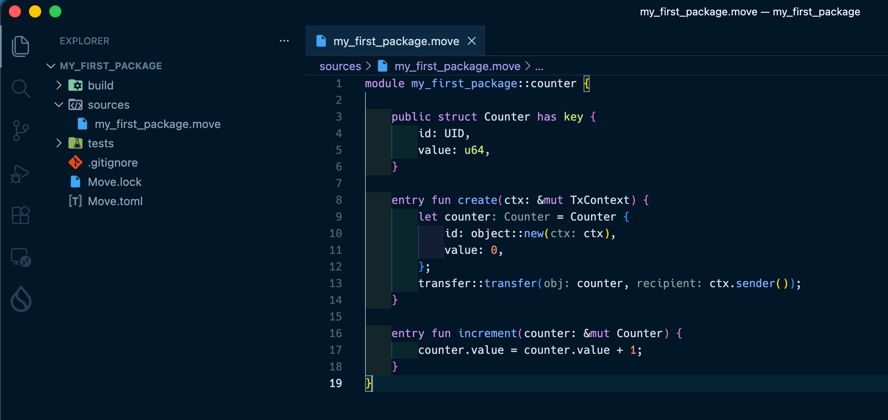

# Write a Minimal Contract

In this lesson, you'll use the concepts from the previous lesson (Package, Module, Object) to write **a real, working contract**. Don't worry — it's simpler than it sounds. All you need is one `struct` and two `entry fun`s for a counter.

---

## Prerequisites

- Completed [Create a Move Project](/docs/learn/beginner/L12-create-move-project)
- Read [Learn Move Mechanics](/docs/learn/beginner/L13-learn-move-mechanics)
- [Sui Extension](/docs/getting-started/L04-vscode-sui-extension) installed in VSCode

---

## Open the File

Open `my_first_package` in VSCode, then open the `.move` file inside the `sources/` folder.

When you ran `sui move new my_first_package`, the file `sources/my_first_package.move` was auto-generated. That's the file you'll edit.



---

## Write the Contract

**Replace the entire contents** of `sources/my_first_package.move` with the following code:

```rust
module my_first_package::counter {

    /// Counter object
    public struct Counter has key {
        id: UID,
        value: u64,
    }

    /// Create a counter and transfer it to the sender
    entry fun create(ctx: &mut TxContext) {
        let counter = Counter {
            id: object::new(ctx),
            value: 0,
        };
        transfer::transfer(counter, ctx.sender());
    }

    /// Increment the counter value by 1
    entry fun increment(counter: &mut Counter) {
        counter.value = counter.value + 1;
    }
}
```



---

## Understanding the Code

Let's connect what you wrote to the concepts from L13.

### The `entry` Keyword

```rust
entry fun create(ctx: &mut TxContext) {
```

Adding `entry` makes this function directly callable as a transaction from a wallet or the CLI (`sui client call`).

:::info Function Visibility in Move

The keyword you place before `fun` determines who can call it.

| Syntax | Wallet / CLI | Other contracts | When to use |
|--------|:-----------:|:---------------:|-------------|
| `fun` | ❌ | ❌ | Internal helpers used only within the same module |
| `entry fun` | ✅ | ❌ | Transaction entry points called directly from a wallet or CLI |
| `public(package) fun` | ❌ | ⚠️ Same package only | Functions shared across modules in the same package (very common) |
| `public fun` | ✅ | ✅ | Fully open APIs — use only when truly necessary, with security in mind |

> **Note:** `public fun` can technically be invoked from a wallet, but it is primarily intended for functions that other contracts or modules need to call. When you want a function to be callable directly as a transaction, `entry fun` is the right choice.

For `create` and `increment` here, we only need to call them from a wallet, not from other contracts — so `entry fun` is the perfect fit.

Note that `entry fun` has a few constraints:
- Return values must have the `drop` ability
- Objects passed to an `entry fun` cannot be reused with other functions in the same transaction
- Functions returning references (`&T` / `&mut T`) are not callable from a wallet
:::

### About `has key`

```rust
public struct Counter has key {
```

In L13 you saw an example using `has key, store`. Here we only use `key`.

- `key` → Allows the struct to exist as a Sui object (required)
- `store` → Allows it to be stored inside another object, and transferred with `public_transfer`

Since this counter won't be stored inside another object, `key` alone is enough. You'll see when to use both in a later lesson.

### About `transfer::transfer`

```rust
transfer::transfer(counter, ctx.sender());
```

This transfers the newly created object to someone. If you try to end the function without transferring it, you'll get a compile error — that's Move's **Linear Types** system, which always tracks where an object goes.

`ctx.sender()` returns the address that submitted the transaction. By sending the counter to yourself, you become the owner of that object.

---

## Verify with a Build

Once the code is written, run a build to check for errors.

**1. Check the devnet chain identifier**

```bash
sui client chain-identifier
```

**2. Add environment config to the end of `Move.toml`**

Use the ID displayed in the previous step (the value below is an example):

```toml
[environments]
devnet = "a63d14dc"
```

Note: devnet resets periodically, and the chain ID changes with each reset. If you see errors later, repeat this step to get the updated ID.

:::info Not needed for testnet or mainnet
`testnet` and `mainnet` are recognized by Sui out of the box, so no extra config is needed. The `[environments]` entry is only required for `devnet`.
:::

**3. Run the build**

```bash
cd ~/sui-projects/my_first_package
sui move build
```

A successful build looks like this:

```
INCLUDING DEPENDENCY MoveStdlib
INCLUDING DEPENDENCY Sui
BUILDING my_first_package
```

:::warning If you see errors
If the Sui Extension is installed, errors are highlighted in real time with red underlines in VSCode. Hover over the line to see the error message.

Common causes:
- Missing semicolons (`;`)
- Unclosed parentheses or braces
:::

---

## Success Checklist

- [ ] Implemented `struct Counter` with `has key`
- [ ] Implemented `create` and `increment` as `entry fun`
- [ ] `sui move build` completed without errors

---

## What You Did in This Lesson

- [x] Implemented functions callable from a wallet or CLI using `entry fun`
- [x] Defined a Sui object with `has key`
- [x] Used `transfer::transfer` to send the object to yourself
- [x] Confirmed the build passes with `sui move build`
