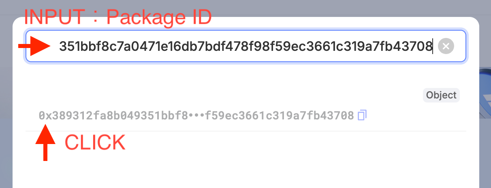
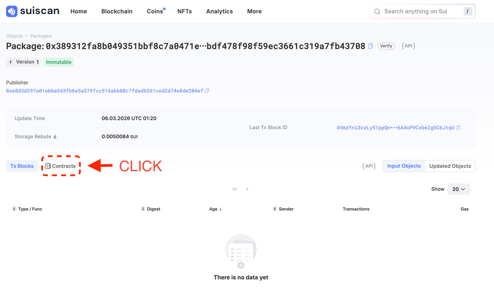

# Call a Contract from Explorer

In the previous lesson you published the counter contract to Devnet. Now let's **call its functions directly from Suiscan's GUI** — no terminal, no code. Just a browser.

---

## Prerequisites

- Completed [Publish a Contract](/docs/learn/beginner/L16-publish-contract) and have the **PackageID** on hand
- Slush wallet [connected to Devnet](/docs/getting-started/L02-switch-devnet)
- [Test tokens in your wallet](/docs/getting-started/L06-get-test-tokens) (gas is required for function calls)

---

## 1. Open the Package in Suiscan

Open [Suiscan (Devnet)](https://suiscan.xyz/devnet/home) in your browser.

<!-- Image: Suiscan Devnet top page -->

Paste the **PackageID** from the previous lesson into the search box and search.

<!-- Image: PackageID entered in the search box -->

The Package page opens. You'll see a **Contracts** section listing the `counter` module.

<!-- Image: Modules section on the Package page -->

<!-- Image: Expanded view after clicking Contracts -->

---

## 2. Create a Counter with `create`

Click the `counter` module to expand it. You'll see a list of functions:

- `create` — creates a Counter object and sends it to your wallet (`entry fun`)
- `increment` — increments the counter by 1 (`entry fun`)
- `get_value` — returns the current counter value (`public fun`)

In Suiscan's UI, only `entry fun` functions show an **Execute** button. `get_value` is a `public fun`, so it has no button — it's intended to be called programmatically from the SDK or other Move modules. You'll verify the value in step 4.

First, run **`create`** to get a Counter object.

Click the **Execute** button next to `create`. (If your wallet isn't connected, click **Connect** and connect with Slush.)

<!-- Image: Function list with Execute button for create -->

`create` takes no arguments (`TxContext` is provided automatically). The wallet signing popup appears right away.

Review the details in Slush and click **Approve**.

<!-- Image: Slush approval popup -->

Once the transaction succeeds, **Transaction applied** appears in the Execute panel. Under **Created** you'll see the Counter object's **ObjectID** (`0x...`).

<!-- Image: Transaction applied result with ObjectID under Created -->

Click the `0x...` address under **Created** to open the Counter object's detail page. It's handy to **right-click → Open in new tab** so you can come back later. Click the **Fields** section to expand it — you'll see `value: 0`, the initial value right after creation.

<!-- Image: Clicking the Fields section -->

<!-- Image: Fields expanded showing value=0 -->

You'll need the ObjectID in the next step. Copy it using the copy icon.

---

## 3. Increment the Counter with `increment`

Go back to the Package page in Suiscan (use your browser's back button or search for the PackageID again) and expand the `counter` module.

This time click the **Execute** button next to **`increment`**.

<!-- Image: Execute button for increment -->

`increment` takes one argument:

| Argument | Type | Value to enter |
|----------|------|----------------|
| `counter` | `Counter` (object ID) | The Counter ObjectID you copied in step 2 |

Paste the Counter ObjectID into the input field.

Click **Execute** and **Approve** in the Slush popup.

Once the transaction succeeds, you're done.

<!-- Image: Successful increment transaction -->

---

## 4. Verify the Value Changed in the Counter Object

Return to the Counter object page (or search for its ObjectID again) and check the **Fields** section.

The `value` should have changed from `0` to `1`.

<!-- Image: Counter object Fields section showing value=1 -->

The value that was `0` in step 2 is now `1` after running `increment`.

:::info Refresh the page
If you kept the page open, refresh your browser (F5 or ⌘R). Without a refresh, you may still see the old cached value.
:::

---

## Success Checklist

- [ ] Searched for the PackageID in Suiscan and opened the Package page
- [ ] Ran `create` and verified the Counter object with `value: 0`
- [ ] Ran `increment` and incremented the counter
- [ ] Confirmed the Counter object's `value` changed to `1`

---

## What You Did in This Lesson

- [x] Searched for a contract Package by PackageID in Suiscan
- [x] Ran `create` to create a Counter object
- [x] Passed an ObjectID as an argument to `increment` and ran it
- [x] Verified the value change directly on the Counter object's Fields
- [x] Successfully called a contract from the Explorer
