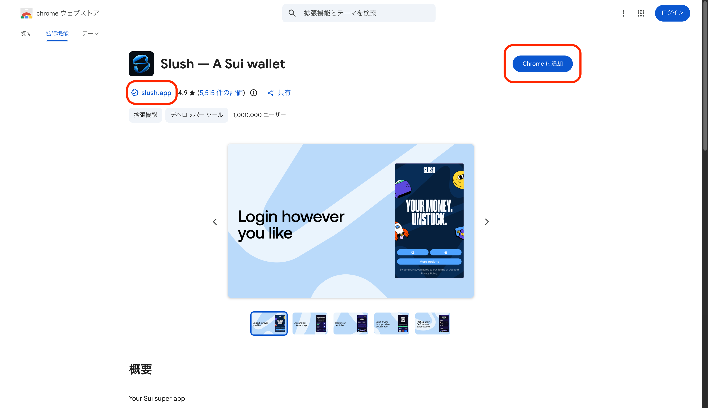

# Slushウォレットを入れる

Suiブロックチェーンを使うための最初のステップとして、Slushウォレットをインストールします。

## 概要

| 項目 | 内容 |
|:--|:--|
| **Goal** | ウォレットをインストールする |
| **所要時間** | 約5分 |
| **使用ツール** | Slush（Chrome拡張） |
| **Success Check** | ウォレットにアドレスが表示される |

## Slushウォレットとは

Slush（旧称「Sui Wallet」）は、Mysten Labs提供のSuiブロックチェーン用ブラウザウォレットです。以下の機能を提供します：

- アカウント（アドレス）の生成と管理
- トランザクションの署名
- dAppとの接続
- ネットワーク（Mainnet/Testnet など）の切り替え

:::tip なぜSlush？
Suiには複数のウォレットがありますが、このチュートリアルではSlushを使用します。公式に近いウォレットで、Sui特有の機能（スポンサードトランザクションなど）に対応しています。
:::

---

## Step 1: Chrome拡張をインストール

1. Chrome Web Storeにアクセスします
   - [Slush - Chrome Web Store](https://chromewebstore.google.com/detail/slush-a-sui-wallet/opcgpfmipidbgpenhmajoajpbobppdil)

2. 開発元が「✓ slush.app」であることを確認してから追加します

   

3. 「Chromeに追加」ボタンをクリックします

4. 確認ダイアログで「拡張機能を追加」をクリックします

:::note
拡張機能をピン留めすると、ツールバーからすぐにアクセスできます。
:::

---

## Step 2: アカウントを作成

Slushには「ソーシャルログイン」（Google/Apple/Facebook/Twitch）と「パスフレーズ」の2つの方式があります。このレッスンでは、後から他ウォレットへ移行しやすい「パスフレーズ方式」で進めます。

1. インストール後、Slushのウェルカム画面が自動で開きます

2. 画面下部の「More options」をクリックします

   

3. 「Create a passphrase account」を選択します

   

---

## Step 3: パスフレーズを保管

1. パスフレーズ（12単語）が表示されます

2. 表示されたパスフレーズを書き留めます

:::danger パスフレーズを安全に保管
パスフレーズは絶対に他人に教えないでください。これがあれば誰でもあなたのウォレットにアクセスできます。紙に書いて安全な場所に保管することを推奨します。
:::

## Step 4: ウォレットのパスワード設定とセキュリティ設定

1. パスワードを設定します
   - 画面の要件を満たすパスワードを設定します（英数字＋記号、長め推奨）

2. 「Protect your wallet with additional security」画面が表示されます
   - **Unlock your wallet**: 自動ロックまでの時間（15分〜1日）を設定
   - **Confirm transactions**: トランザクション時にパスワードを要求
   - お好みで設定し「Next」をクリック

3. 確認が完了すると、ウォレットのメイン画面が表示されます

---

## Success Check

ウォレットの`Settings`にアドレスが表示されていれば成功です。

アドレスは `0x` で始まる長い16進数文字列です（多くの場合 `0x` + 64桁、例: `0x1234...abcd`）。

:::tip アドレスのコピー
アドレスをクリックするとクリップボードにコピーされます。後のレッスンで使用します。
:::

---

## What's Next?

ウォレットのインストールが完了しました。次のレッスンでは、ネットワークをDevnetに切り替えます。

**Next Lesson**: [Devnetに切り替える](./L02-switch-devnet.mdx)

---

## Summary

このレッスンで学んだこと：

- [x] SlushウォレットをChromeにインストール
- [x] 新しいアカウントを作成
- [x] パスフレーズをバックアップ
- [x] ウォレットアドレスを確認
