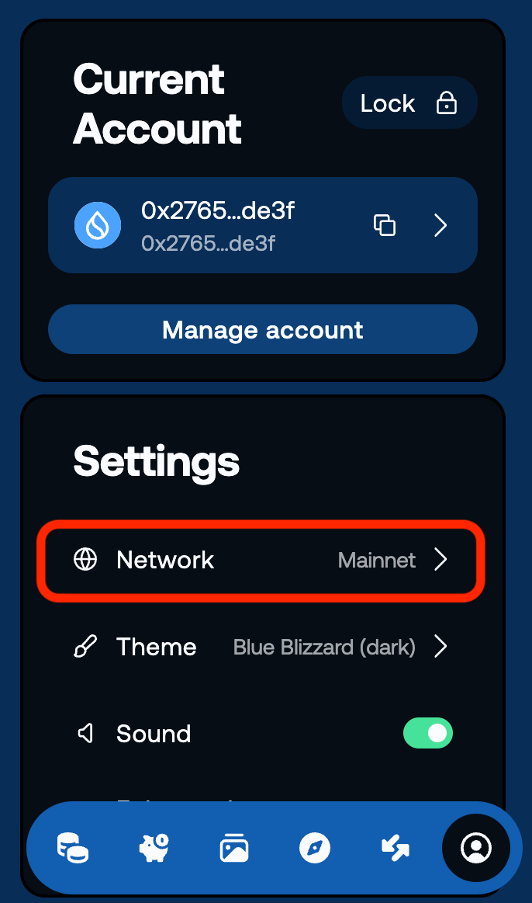

# Devnetに切り替える

ウォレットの準備ができたら、次はネットワークを開発用に切り替えましょう。2分もかからない簡単な作業です。

## Devnetとは？

Suiには複数のネットワークがあります。

- **Mainnet** — 本番環境。実際の資産を扱います｡
- **Testnet** — 検証環境。本番前の動作確認や総合テストに向いています｡
- **Devnet** — 開発環境。気軽に試行錯誤しながら開発を進めるのに向いています｡

このチュートリアルでは、**Devnet**を使って学習を進めます。

Devnetは、開発や学習を目的としたネットワークで、テスト用のSUI（ガス）を**無料で何度でも取得**できます。  
実際に操作しながら試行錯誤できるため、はじめてSuiを触る方でも安心して取り組めます。

なお、**Mainnet**は実際の価値を持つ本物のSUIを扱う本番環境です。  
このチュートリアルでは使用しないので、安心してDevnetで進めてください。

:::tip なぜDevnetを使うの？
Devnetは、SuiCLIからFaucetを使って手軽にテスト用SUI（ガス）を受け取れるため、学習に向いています。 
一方、TestnetのFaucetはアクセス集中やレート制限の影響で、すぐに受け取れず待ち時間が発生する場合があります。 
※ Devnetは比較的高い頻度でデータがリセットされます。長期の検証や成果物を残したい場合は、Testnetを使用しましょう。
:::

## Faucetとは？

**Faucet**（フォーセット）は、DevnetやTestnetでガス代として使うテストトークンを無料で取得できるサービスです。  
[Sui Faucet](https://faucet.sui.io/) やCLIから取得できます。

Faucetの詳しい使い方は、[テストトークンを取得する](./L06-get-test-tokens)で解説します。

---

## Devnetに切り替える

Slushウォレットでネットワークを切り替えます。

### 1. Settingsを開く

1. ブラウザのツールバーからSlushアイコンをクリックしてウォレットを開きます  
   （パスワードを求められた場合は入力してください）

2. 右下のユーザーアイコンをクリックして「**Settings**」画面を開きます

### 2. Devnetを選択する

1. 「**Network**」をクリックします

2. 「**Devnet**」を選択します

---

## 成功の確認

ウォレットのメイン画面に戻り、上部に「**Devnet**」と表示されていれば成功です。

---

## このレッスンでやったこと

- [x] Devnetについて理解した
- [x] ウォレットのネットワークをDevnetに切り替えた
- [x] Devnetに切り替わったことを確認した
