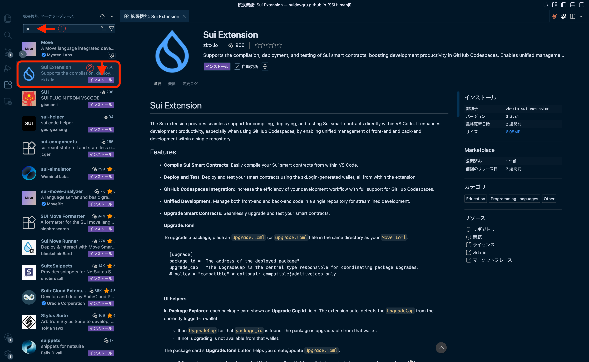

# VSCode + Sui Extensionでエディタを設定する

VSCodeに**Sui Extension**をインストールして、Move開発環境を整えましょう。この拡張機能を使うと、コントラクトのコンパイル・デプロイ・テストがVSCode内で完結します。

難しくありません。拡張機能をインストールして、Googleアカウントでログインするだけです。

## Sui Extensionとは？

Sui Extensionは、[zktx.io](https://zktx.io/)が開発したVSCode向けのSui開発支援ツールです。

- **zkLoginウォレット** — Googleアカウントでウォレットを作成（Devnet/Testnet対応）
- **コンパイル・デプロイ・テスト** — VSCode内でMoveプロジェクトを管理
- **Package Explorer** — デプロイ済みコントラクトの確認・操作
- **Object Explorer** — Suiオブジェクトの検査
- **PTB-Builder** — ビジュアルでトランザクションを構築
- **テンプレート** — 30以上のMoveテンプレートでプロジェクトを素早く開始

このチュートリアルでは、Sui Extensionを使ってコントラクトをデプロイしたり、テストしたりしていきます。

:::tip Slushウォレットとの使い分け
L01-L02でセットアップした**Slush**と、この拡張機能の**zkLoginウォレット**は別物です。

- **Slush** — ブラウザでdAppを操作するときに使う
- **zkLogin（Sui Extension）** — VSCode内でコントラクトをデプロイ・テストするときに使う

開発では両方を使い分けます。
:::

---

## 手順

### 1. VSCodeをインストールする

まだVSCodeをお使いでない場合は、[公式サイト](https://code.visualstudio.com/)からダウンロードしてインストールしてください。

すでにインストール済みの方は、次のステップに進みます。

---

### 2. Sui Extensionをインストールする

1. **VSCodeを開く**

2. **拡張機能パネルを開く**
   - 左側のサイドバーにある四角が4つ並んだアイコンをクリック
   - または `Ctrl+Shift+X`（macOSは `Cmd+Shift+X`）

3. **検索バーに「Sui Extension」と入力**

4. **「Sui Extension」（zktx.io製）を探してインストール**
   - 発行元が「zktx.io」であることを確認してください

<!-- 画像: 拡張機能の検索画面でSui Extensionを検索している様子 -->
<!--  -->

インストールが完了すると、左側のアクティビティバー（縦に並んだアイコン）にSuiのアイコンが追加されます。

---

### 3. Sui Extensionを開く

1. **アクティビティバーのSuiアイコンをクリック**

   左側のアクティビティバーに追加されたSuiアイコンをクリックします。

2. **パネルを確認**

   サイドバーにSui Extensionのパネルが表示されます。

<!-- 画像: Sui Extensionのパネルが表示された状態 -->
<!--  -->

---

### 4. zkLoginでウォレットを作成する

1. **ネットワークを「Devnet」に設定**

   パネル上部のネットワーク選択で「Devnet」を選びます。

2. **「Google Login」ボタンをクリック**

3. **Googleアカウントで認証**

   ブラウザが開くので、Googleアカウントでログインします。

4. **ウォレットアドレスを確認**

   認証が完了すると、パネルにウォレットアドレス（`0x...`）が表示されます。

<!-- 画像: zkLoginでウォレットが作成された状態 -->
<!--  -->

:::warning セッションの有効期限
zkLoginウォレットには有効期限があります。期限が切れたら再度「Google Login」でログインしてください。
:::

---

## 成功の確認

以下が確認できれば成功です。

- [x] Sui Extensionがインストールされている（アクティビティバーにSuiアイコンがある）
- [x] ネットワークが「Devnet」になっている
- [x] Walletパネルにアドレス（`0x...`）が表示されている

---

## このレッスンでやったこと

- [x] Sui Extensionが何をするツールか理解した
- [x] VSCodeにSui Extensionをインストールした
- [x] zkLoginでウォレットを作成した
- [x] Devnetに接続した
