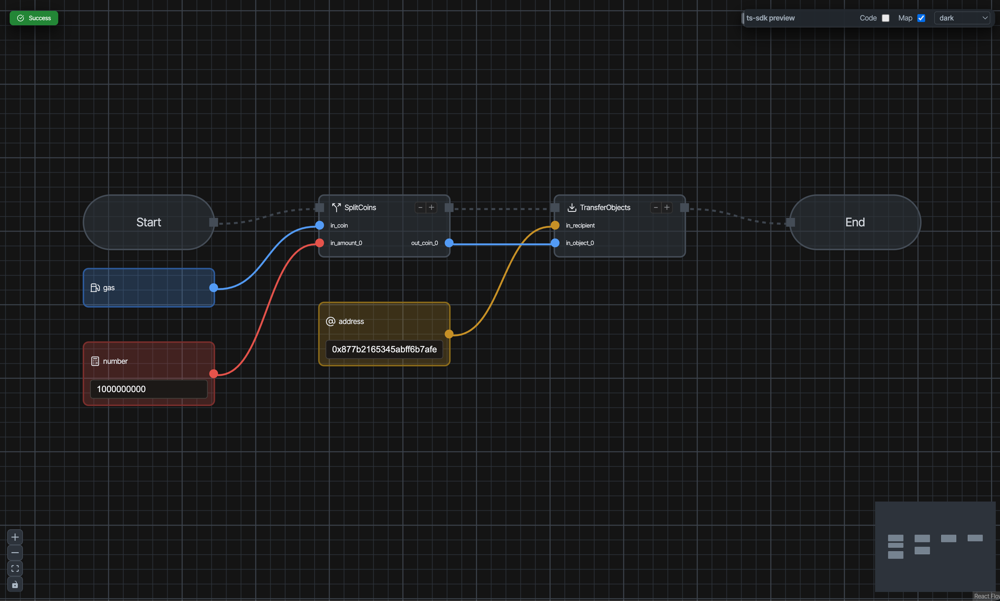

# CLIで送金する

このレッスンでは、Sui CLIを使って別のアドレスにSUIトークンを送金する方法を学びます。これはブロックチェーンの最も基本的な操作の一つです。コマンド1つで送金できるので、難しくありません！

:::tip なぜCLIでの送金を学ぶの？
ウォレットは使いやすいインターフェースを提供しますが、CLIでの送金を理解すると：
- スクリプトでトランザクションを自動化できる
- アプリケーションのテストやデバッグができる
- トランザクションの構造を深く理解できる
:::

---

## 前提条件

このレッスンを始める前に、以下が完了していることを確認してください：

- Sui CLIがインストール済み（`sui --version` で確認）— [Sui CLIをインストール](/docs/getting-started/L03-install-sui-cli)
- CLIがDevnetに接続済み（`sui client active-env` が `devnet` を返す）— [CLIをDevnetに接続](/docs/getting-started/L05-connect-cli-to-devnet)
- Faucetでテスト用SUIを取得済み（`sui client gas` で残高を確認）— [テストトークンを取得する](/docs/getting-started/L06-get-test-tokens)

---

## 手順

### 1. 現在のアドレスと残高を確認する

まず、現在のアドレスとSUIの残高を確認しましょう。

```bash
sui client active-address
```

以下のようにアドレスが表示されます：
```
0x1234abcd...
```

次に残高を確認します：

```bash
sui client gas
```

以下のような出力が表示されます：
```
╭────────────────────────────────────────────────────────────────────┬────────────────────┬──────────────────╮
│ gasCoinId                                                          │ mistBalance (MIST) │ suiBalance (SUI) │
├────────────────────────────────────────────────────────────────────┼────────────────────┼──────────────────┤
│ 0xabcd1234...                                                      │ 1000000000         │ 1.00             │
╰────────────────────────────────────────────────────────────────────┴────────────────────┴──────────────────╯
```

:::info MISTとSUI
1 SUI = 1,000,000,000 MIST（10億MIST）です。MISTはSUIの最小単位で、ビットコインにおけるsatoshiのようなものです。
:::

### 2. 送金先のアドレスを確認する

送金先として、[Slushウォレットをインストール](/docs/getting-started/L01-install-slush) で作成したSlushウォレットのアドレスを使います。

CLIのアドレス（[CLIをDevnetに接続](/docs/getting-started/L05-connect-cli-to-devnet) で生成）とSlushで最初に作成したアドレスは**別のアドレス**です。今回はCLIアドレスからSlushウォレットアドレスへSUIを送金します。

**Slushウォレットのアドレスを確認する方法：**

1. ブラウザ拡張機能のSlushを開く
2. 右下のユーザーアイコン①をクリックし、「**Manage all**」②を選択
3. [Slushウォレットをインストール](/docs/getting-started/L01-install-slush)で作成したアカウントに切り替える（[CLIをDevnetに接続](/docs/getting-started/L05-connect-cli-to-devnet)でインポートしたCLIアカウントではない方）
4. アドレス（`0x...`）をコピーする


:::tip アドレスの見分け方
Slushに複数のアカウントがある場合、右下のユーザーアイコンからアカウントを切り替えられます。[テストトークンを取得する](/docs/getting-started/L06-get-test-tokens)でFaucetからSUIを受け取ったアカウント（CLIアドレス）は残高がありますが、[Slushウォレットをインストール](/docs/getting-started/L01-install-slush)で最初に作ったアカウントは残高が0のはずです。
:::

### 3. PTBでSUIを送金する

それでは、SUIを送金しましょう！`<RECIPIENT_ADDRESS>` を送金先のアドレスに置き換えてください：

```bash
sui client ptb \
  --split-coins gas "[1000000000]" \
  --assign coins \
  --transfer-objects "[coins]" @<RECIPIENT_ADDRESS> \
  --gas-budget 10000000
```

:::info コマンドの解説
- `--split-coins gas "[1000000000]"`: ガスコイン（SUI）から1000000000 MIST（= 1 SUI）を分割します。`gas` キーワードを使うと、CLIが自動で使用するコインを選んでくれます
- `--assign coins`: 分割したコインを `coins` という変数に代入します
- `--transfer-objects "[coins]" @<ADDRESS>`: `coins` を指定したアドレスに送金します（アドレスの前に `@` が必要です。`<>` は付けずに実際のアドレスに置き換えてください）
- `--gas-budget`: ガス代の**上限**（MIST単位）。実際に使った分だけ消費され、残りは戻ってきます（例：10000000 MIST = 0.01 SUI）
:::

:::tip PTB（Programmable Transaction Block）とは？
PTBはSuiの強力な機能で、複数の操作を1つのトランザクションにまとめて実行できます。今回は「コインを分割 → 送金」という2つの操作を1回のトランザクションで行っています。
:::

コマンドを実行すると、以下のような詳細な出力が表示されます：

```
Transaction Digest: AbC123xYz...
╭─────────────────────────────────────────────────────────────────────────────────────────────────╮
│ Transaction Data                                                                                │
├─────────────────────────────────────────────────────────────────────────────────────────────────┤
│ Sender: 0x1234abcd...                                                                           │
│ ...                                                                                             │
```

**Transaction Digest** がトランザクションの固有IDです。これをコピーしておきましょう！

### 4. トランザクションを確認する

トランザクションが成功したことを確認しましょう。

#### Explorerで確認

Suiscanでも確認できます：

1. [Suiscan (Devnet)](https://suiscan.xyz/devnet/home) にアクセス
2. **Devnet** になっていることを確認
3. 検索ボックスにTransaction Digestを貼り付け
4. トランザクションが「Success」と表示されていることを確認


Explorerでのトランザクションの読み方について詳しくは、[Explorerでトランザクションを読む](/docs/learn/beginner/L08-read-tx-in-explorer) を参照してください。

#### PTB Builderで確認

[PTB Builder](https://ptb.wal.app/) のViewer機能を使うと、トランザクションの内容を視覚的に確認できます：

1. [PTB Builder（ptb.wal.app）](https://ptb.wal.app/) にアクセス
2. ネットワークを **DEVNET** に設定し、「**Connect Wallet**」でSlushを接続
3. 「**Viewer**」を選択
4. 検索ボックスにTransaction Digestを貼り付け
5. トランザクションの構造（SplitCoins → TransferObjects）が視覚的に表示される



PTB Builderの詳しい使い方は、[ウォレットをPTB Builderに接続する](/docs/learn/beginner/L07-connect-wallet-to-ptb-builder) を参照してください。

### 5. 残高の変化を確認する

最後に、両方のアドレスの残高を確認して送金を確認します。

**CLIアドレス（送金元）の残高：**

```bash
sui client gas
```

送金前よりも残高が減っていることを確認しましょう（送金額 + ガス代の分だけ減ります）。

**Slushウォレットアドレス（送金先）の残高：**

Slushを開いて、[Slushウォレットをインストール](/docs/getting-started/L01-install-slush)で作成したアカウントに切り替えると、送金したSUIが反映されているはずです。


:::tip 反映に少し時間がかかる場合があります
Devnetでは通常数秒で反映されますが、まれに少し時間がかかることがあります。Slushの画面をリロードしてみてください。
:::

---

## 成功の確認

以下ができれば、このレッスンは完了です：

- `sui client ptb` で送金を正常に実行できた
- `Transaction Digest`を取得できた
- `Explorer(Suiscan)` / `PTB Builder`でトランザクションのステータスを確認できた
- 送金元と送金先の両方で残高の変化を確認できた

---

## よくあるトラブル

### "Insufficient gas" エラー

アカウントにガス代を支払うのに十分なSUIがありません。[Faucet](/docs/getting-started/L06-get-test-tokens)から追加のトークンを取得してください。

### "Invalid address" エラー

- 送金先アドレスが正しいか確認してください（`0x` で始まる必要があります）
- 余分なスペースや文字が含まれていないか確認してください

### トランザクションが "Failed" と表示される

- トランザクション詳細でエラーメッセージを確認してください

---

## このレッスンでやったこと

- [x] CLIでアドレスと残高を確認する方法を学んだ
- [x] PTB（`sui client ptb`）でSUIを送金する方法を学んだ
- [x] MISTとSUIの関係を理解した
- [x] CLIとExplorerでトランザクションを確認した
