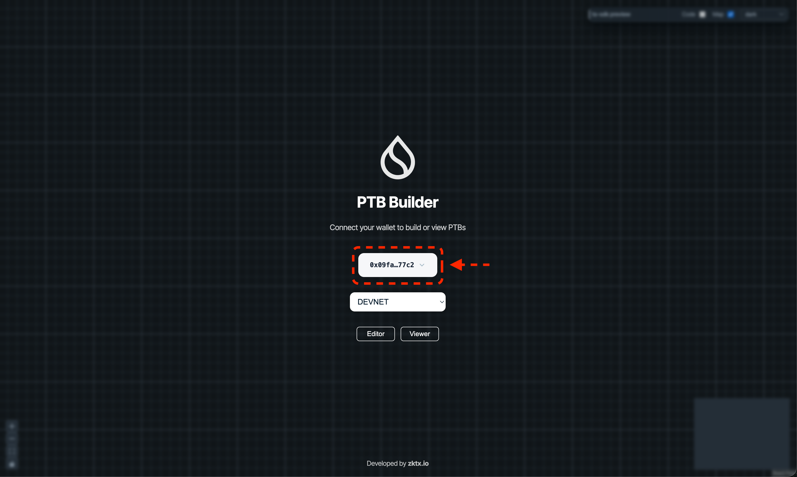

# 2操作を合成

このレッスンでは、PTB Builderを使って**2つの送金操作を1つのトランザクションにまとめる**方法を学びます。**難しくありません**。手順どおりに進めれば、すぐにできるようになります。

## PTB（Programmable Transaction Block）とは

Suiでは、複数の操作を**1つのトランザクション**にまとめて実行できます。これを **PTB（Programmable Transaction Block）** と呼びます。

PTBを使うと、以下のようなメリットがあります：

- **ガス代の節約** — 複数の操作を個別に実行するより、まとめた方が安くなります
- **原子性（アトミック性）** — すべての操作が成功するか、すべて失敗するかのどちらかになります（中途半端な状態になりません）
- **効率的** — 1回の署名で複数の操作を完了できます

:::tip PTBのイメージ
「Aさんに100 SUI送金」と「Bさんに200 SUI送金」を別々に実行すると、2回署名が必要で、ガス代も2回かかります。
PTBでまとめると、1回の署名・1回のガス代で済みます。
:::

---

## 前提条件

このレッスンを始める前に、以下が完了していることを確認してください：

- [Slushウォレットをインストール](/docs/getting-started/L01-install-slush) 済み
- [Devnetに切り替え](/docs/getting-started/L02-switch-devnet) 済み
- [Faucetでテストトークンを取得](/docs/getting-started/L06-get-test-tokens) 済み
- [ウォレットをPTB Builderに接続する](/docs/learn/beginner/L07-connect-wallet-to-ptb-builder) 済み

---

## 手順

### 1. PTB Builderを開く

以下のリンクからPTB Builderにアクセスします。

→ [PTB Builder（ptb.wal.app）](https://ptb.wal.app/)

### 2. ウォレットを接続してEditorを開く

1. ネットワークを「**DEVNET**」に設定します
2. 「**Connect Wallet**」をクリックしてSlushウォレットを接続します
3. 画面下部の「**Editor**」をクリックします



:::note 接続方法の詳細
ウォレット接続の詳しい手順は [L07: ウォレットをPTB Builderに接続する](/docs/learn/beginner/L07-connect-wallet-to-ptb-builder) を参照してください。
:::

### 3. 送金先アドレスを2つ用意する

2人に送金するには、送金先のアドレスが2つ必要です。

テストなので、以下のいずれかの方法でアドレスを用意しましょう：

- **方法1**: Slushウォレットで新しいアカウントを作成し、そのアドレスを使う
- **方法2**: 自分のアドレスを2回使う（自分自身に送金する形になります）

:::tip 自分のアドレスの確認方法
Slushウォレットを開いて、アドレス部分をクリックするとコピーできます。
または、ターミナルで以下のコマンドを実行します：
```bash
sui client active-address
```
:::

### 4. 1つ目の送金操作を追加

Editor画面で、以下の手順で1つ目の送金を設定します。

#### 4.1 SplitCoinsコマンドを追加

1. 画面を右クリックして、メニューから「**Sui Commands**」→「**SplitCoins**」を選択します
2. 「**SplitCoins**」ノードが追加されます

#### 4.2 TransferObjectsコマンドを追加

1. 再度画面を右クリックして、「**Sui Commands**」→「**TransferObjects**」を選択します
2. 「**TransferObjects**」ノードが追加されます

#### 4.3 ノードを接続

1. **Start** ノードの「**next**」ポートから **SplitCoins** ノードの「**prev**」ポートへドラッグして接続します
2. **SplitCoins** ノードの「**next**」から **TransferObjects** ノードの「**prev**」へ接続します
3. **TransferObjects** ノードの「**next**」から **End** ノードの「**prev**」へ接続します

#### 4.4 変数を接続

1. **gas** ノードを **SplitCoins** の「**in_coin**」に接続します（送金元のコイン）
2. 送金額を設定するため、画面を右クリックして「**Variables**」→「**number**」を選択し、値を入力します（例: `1000000000` = 1 SUI）
3. **number** ノードを **SplitCoins** の「**in_amount_0**」に接続します
4. **SplitCoins** の「**out_coin_0**」を **TransferObjects** の「**in_object_0**」に接続します
5. 送金先アドレスを設定するため、画面を右クリックして「**Variables**」→「**address**」を選択し、送金先アドレス1を入力します
6. **address** ノードを **TransferObjects** の「**in_recipient**」に接続します

これで1つ目の送金設定が完了です。

### 5. 2つ目の送金操作を追加

同じ要領で2つ目の送金を追加します。

#### 5.1 2つ目のSplitCoinsとTransferObjectsを追加

1. 画面を右クリックして「**Sui Commands**」→「**SplitCoins**」を追加
2. 同様に「**TransferObjects**」も追加

#### 5.2 フローを接続

1. 最初の **TransferObjects** ノードの「**next**」から **End** への接続を削除します
2. 最初の **TransferObjects** の「**next**」を2つ目の **SplitCoins** の「**prev**」に接続します
3. 2つ目の **SplitCoins** の「**next**」を2つ目の **TransferObjects** の「**prev**」に接続します
4. 2つ目の **TransferObjects** の「**next**」を **End** の「**prev**」に接続します

#### 5.3 2つ目の変数を接続

1. **gas** ノードを2つ目の **SplitCoins** の「**in_coin**」にも接続します
2. 新しい **number** ノードを追加し、2つ目の送金額を入力します（例: `2000000000` = 2 SUI）
3. **number** ノードを2つ目の **SplitCoins** の「**in_amount_0**」に接続します
4. 2つ目の **SplitCoins** の「**out_coin_0**」を2つ目の **TransferObjects** の「**in_object_0**」に接続します
5. 新しい **address** ノードを追加し、送金先アドレス2を入力します
6. **address** ノードを2つ目の **TransferObjects** の「**in_recipient**」に接続します

### 6. 完成したPTBを確認

最終的なフローは以下のようになります：

```
Start → SplitCoins(1) → TransferObjects(1) → SplitCoins(2) → TransferObjects(2) → End
```

全体として：
- **gas** からコインを2回分割（SplitCoins）
- 分割したコインをそれぞれ別のアドレスに送金（TransferObjects）

### 7. トランザクションを実行

1. 画面右上の「**Execute**」ボタンをクリックします
2. Slushウォレットのポップアップが表示されます
3. 内容を確認して「**Approve**」をクリックします
4. 成功すると Transaction Digest が表示されます

:::warning ガス残高を確認
トランザクションを実行するにはガス代が必要です。残高が不足している場合は、先に [Faucet](/docs/getting-started/L06-get-test-tokens) で追加のSUIを取得してください。
:::

### 8. Explorerで確認

1. 表示された Transaction Digest をコピーします
2. [Suiscan (Devnet)](https://suiscan.xyz/?network=devnet) を開きます
3. Transaction Digest を検索します
4. **Transactions** セクションで、2つの TransferObjects 操作が含まれていることを確認します

---

## 成功の確認

以下ができれば、このレッスンは完了です：

- [ ] PTB Builderで2つのSplitCoins + TransferObjectsを設定できた
- [ ] 1つのトランザクションとして実行できた
- [ ] Explorerで2つの送金操作が含まれていることを確認できた

---

## よくあるトラブル

### 接続がうまくいかない

- ポート同士を正確にドラッグして接続してください
- 型が合わないポートは接続できません（例: number を address に接続することはできません）

### Execute ボタンが押せない

- すべてのノードが正しく接続されているか確認してください
- Start から End まで途切れなくフローが繋がっている必要があります

### トランザクションが失敗する

- ガス残高が十分にあるか確認してください
- 送金額の合計がガス残高を超えていないか確認してください

---

## 演習: TSコードに変換してみよう

PTB Builderには、作成したPTBをTypeScriptコードとしてエクスポートする機能があります。

1. 画面右上の「**Export**」ボタンをクリックします
2. 表示されたTypeScriptコードを確認します

このコードは、次のレッスン（L11）で詳しく解説します。今は「GUIで作ったものがコードになるんだ」ということを確認できればOKです。

---

## このレッスンでやったこと

- [x] PTB（Programmable Transaction Block）の概念を理解した
- [x] PTB Builderで2つの送金操作を設定した
- [x] 1つのトランザクションにまとめて実行した
- [x] Explorerで結果を確認した
- [x] TSコードへのエクスポート機能を確認した 