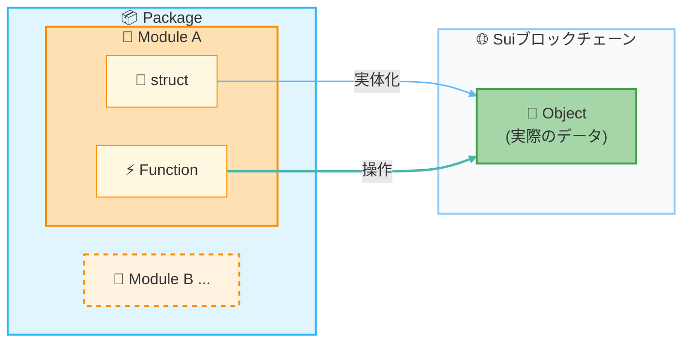

# Moveの仕組みを知ろう

このレッスンでは、Moveの3つの重要な概念 — **Package**、**Module**、**Object** — を学びます。**難しくありません**。コードを書かずに、図とサンプルコードを読むだけです。

## なぜMoveの仕組みを知る必要がある？

前のレッスンでMoveプロジェクトを作成しました。次のレッスンでは実際にコードを書いていきますが、その前にMoveの基本構造を理解しておくと、コードの意味がずっと分かりやすくなります。

Moveは他のプログラミング言語とは異なる独自の概念を持っています。特に**Object**という概念は、Sui Moveの最も重要な仕組みです。

---

## 3つの概念の関係

まず、Package・Module・Objectがどのような関係にあるか、全体像を見てみましょう。


```mermaid
%%{init: {'theme':'default','flowchart':{'rankSpacing':80,'nodeSpacing':40}}}%%
flowchart LR
    %% --- 左側：Package ---
    subgraph Pkg ["📦 Package"]
        subgraph ModA ["📄 Module A"]
            TypeA["📐 struct"]
            FuncA["⚡ Function"]
        end
        ModB["📄 Module B ..."]
    end

    %% --- 右側：ブロックチェーン ---
    subgraph Chain ["🌐 Suiブロックチェーン"]
        Obj["🔷 Object<br/>(実際のデータ)"]
    end

    %% --- 矢印（型と関数の両方から1つのObjectへ） ---
    TypeA -->|"実体化"| Obj
    FuncA ==>|"操作"| Obj

    %% --- リンクスタイリング（0: 実体化, 1: 操作）---
    linkStyle 0 stroke:#64b5f6,stroke-width:1.5px
    linkStyle 1 stroke:#4db6ac,stroke-width:2.5px

    %% --- スタイリング ---
    style Pkg fill:#e1f5fe,stroke:#29b6f6,stroke-width:2px
    style ModA fill:#ffe0b2,stroke:#fb8c00,stroke-width:2px,color:#333
    style ModB fill:#fff3e0,stroke:#fb8c00,stroke-width:2px,stroke-dasharray: 5 5,color:#333

    style TypeA fill:#fff8e1,stroke:#fb8c00,color:#333
    style FuncA fill:#fff8e1,stroke:#fb8c00,color:#333

    style Chain fill:#f8fafc,stroke:#90caf9,stroke-width:2px,color:#333
    style Obj fill:#a5d6a7,stroke:#43a047,stroke-width:2px,color:#333
```

---

## Package（パッケージ）

**Package**は、Moveコードをまとめる一番大きな単位です。前のレッスンで `sui move new` コマンドで作成したフォルダ全体がPackageに相当します。

### Packageの特徴

- `Move.toml` ファイルで設定を管理
- 1つ以上のModuleを含む
- Suiにデプロイ（公開）するときの単位
- 公開後は**Package ID**で識別される

### Move.tomlの中身

`Move.toml` はPackageの設定ファイルです。パッケージ名や依存関係が記述されています。

```toml
[package]
name = "my_first_package"
edition = "2024.beta"

[dependencies]
Sui = { git = "https://github.com/MystenLabs/sui.git", subdir = "crates/sui-framework/packages/sui-framework", rev = "framework/testnet" }

[addresses]
my_first_package = "0x0"
```

:::info
`[addresses]` セクションの `"0x0"` は、公開前のプレースホルダーです。Suiにデプロイすると、デプロイ結果として実際のPackage IDが発行されます（Move.tomlを自動書き換えするわけではありません）。
:::

---

## Module（モジュール）

**Module**は、関連する機能をまとめた単位です。`sources/` ディレクトリ内の `.move` ファイルに記述します。

### Moduleの特徴

- 関数（function）や型（struct）を定義する
- 1つの `.move` ファイルに1つのModuleを書くのが一般的
- `module パッケージ名::モジュール名` の形式で宣言

### Moduleの例

```rust
module my_first_package::counter {
    // このModule内で使う型や関数を定義

    /// カウンターを表すstruct（型）
    public struct Counter has key, store {
        id: UID,
        value: u64,
    }

    /// カウンターの値を増やす関数
    public fun increment(counter: &mut Counter) {
        counter.value = counter.value + 1;
    }
}
```

この例では：
- `my_first_package` がPackage名
- `counter` がModule名
- `Counter` が型（struct）
- `increment` が関数

---

## Object（オブジェクト）

Object（オブジェクト）は、Sui Moveの最も重要な概念です。Sui上で「所有権を持つデジタル資産」を表現するための特別なデータ型です。

### なぜObjectが重要？

従来のプログラミングでは、データは自由にコピーしたり削除したりできます。しかし、ブロックチェーン上のトークンやNFTがコピーできてしまったら大問題ですよね。

Sui Moveでは、Objectに対して以下の制限を設けることで、デジタル資産を安全に扱えます：

- **コピー禁止** — Objectはコピーできない（無限増殖を防ぐ）
- **削除禁止** — Objectは明示的に消費するか、どこかに保存しないと捨てられない
- **所有権** — Objectには必ず所有者がいる

### Abilityによる制御

Moveでは、structに**Ability（能力）** を付与することで、その型の振る舞いを制御します。

```rust
// key = Suiオブジェクトとしてチェーン上に保持できる（SuiではUIDフィールドが必要）
public struct Counter has key, store {
    id: UID,
    value: u64,
}

// copy + drop = 自由にコピー・破棄できる（普通のデータ）
public struct Config has copy, drop {
    max_value: u64,
}
```

主なAbility：

- `key` — Suiオブジェクトとしてチェーン上に保持できる（SuiではUIDフィールドが必要）
- `store` — 値を他のオブジェクトのフィールドに入れられる（公開転送などで要求される場面がある）
- `copy` — コピー可能
- `drop` — その変数をもう使わなくなった時点で、自動的に破棄してよい

:::tip
`key` を持ち、`copy` と `drop` を持たないstructが、典型的なObject（デジタル資産）です。これにより、トークンやNFTの安全性を高めます。
:::

---

## サンプルコードで確認

3つの概念を含む完全なサンプルコードを見てみましょう。

このコードは概念説明用の簡略版です。実際に実行するには `use` によるモジュールのインポートが必要です。

```rust
// Module宣言: Package名::Module名
module my_first_package::counter {

    // === Objectの定義 ===

    /// カウンターオブジェクト
    /// key: Suiオブジェクトとして存在できる
    /// store: 他のオブジェクトに格納できる
    public struct Counter has key, store {
        id: UID,       // すべてのSuiオブジェクトに必須
        value: u64,    // カウンターの値
    }

    // === 関数の定義 ===

    /// 新しいカウンターを作成して呼び出し元に転送
    public fun create(ctx: &mut TxContext) {
        let counter = Counter {
            id: object::new(ctx),
            value: 0,
        };
        transfer::public_transfer(counter, ctx.sender());
    }

    /// カウンターの値を1増やす
    public fun increment(counter: &mut Counter) {
        counter.value = counter.value + 1;
    }

    /// 現在の値を取得
    public fun value(counter: &Counter): u64 {
        counter.value
    }
}
```

このコードのポイント：

1. **Package**: このファイルは `my_first_package` パッケージの一部
2. **Module**: `counter` モジュールとして機能をまとめている
3. **Object**: `Counter` structは `key` を持つため、Suiオブジェクトとして存在し、所有権を持つ

---

## まとめ

- **Package**: コードをまとめる最大の単位。`my_first_package` フォルダ全体がこれにあたります。
- **Module**: 機能をグループ化する単位。`counter.move` ファイル内の `counter` モジュールがこれにあたります。
- **Object**: 所有権を持つデジタル資産。`key` ability を持つ `Counter` struct がこれにあたります。

---

## 成功の確認

以下ができれば、このレッスンは完了です：

- [ ] Package・Module・Objectの3つの概念を説明できる
- [ ] サンプルコードを見て、どこがModule宣言でどこがObjectかわかる
- [ ] Abilityの役割（key, store, copy, drop）を理解した

---

## このレッスンでやったこと

- [x] Package・Module・Objectの3つの概念を学んだ
- [x] それぞれの関係性を図で確認した
- [x] Abilityによる型の制御を理解した
- [x] サンプルコードで3概念の実際の使い方を確認した

次のレッスンでは、実際にシンプルなスマートコントラクトを書いていきます。ここで学んだ概念が、コードを書くときの基礎になります。
