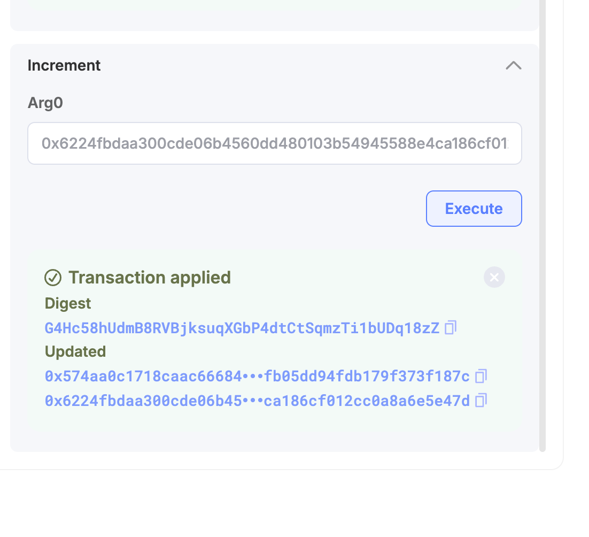

# Explorerから関数を呼び出す

前のレッスンでDevnetにpublishしたカウンターコントラクトを、**SuiscanのGUIから呼び出してみましょう**。ターミナルもコードも不要です。ブラウザだけで完結します。

---

## 前提条件

- [コントラクトをパブリッシュする](/docs/learn/beginner/L16-publish-contract) を完了し、**PackageIDを手元にメモしてある**こと
- Slushウォレットが[Devnetに接続されている](/docs/getting-started/L02-switch-devnet)こと
- ウォレットに[テストトークンがある](/docs/getting-started/L06-get-test-tokens)こと（関数呼び出しにガス代が必要です）

---

## 1. SuiscanでPackageを開く

ブラウザで [Suiscan (Devnet)](https://suiscan.xyz/devnet/home) を開きます。

<!-- 画像: SuiscanのDevnetトップページ -->

検索ボックスに前のレッスンで取得した **PackageID** を貼り付けて検索します。

:::caution
貼り付けるのは **Package ID** です。ウォレットのアカウントアドレスと混同しないよう注意してください。Package ID は `sui client publish` の出力で `Published Objects` に表示されたもので、アカウントアドレスとは異なります。
:::

<!-- 画像: 検索ボックスにPackageIDを入力している状態（Package IDが赤枠でハイライトされている） -->

検索結果のPackageページが開きます。ページ内に **Contracts** セクションがあり、`counter` というモジュール名が見えるはずです。

<!-- 画像: PackageページのModulesセクション -->

<!-- 画像: Contractsボタンを押した後の展開画面 -->

---

## 2. `create` 関数でカウンターを作成する

`counter` モジュールをクリックして展開します。関数の一覧が表示されます。

- `create` ── カウンターオブジェクトを作成して自分のウォレットに送る（`entry fun`）
- `increment` ── カウンターの値を1増やす（`entry fun`）
- `get_value` ── カウンターの現在値を返す（`public fun`）

Suiscan の UI では `entry fun` のみ **Execute** ボタンが表示されます。`get_value` は `public fun` のためボタンがなく、SDK や他の Move モジュールからプログラム的に呼び出す用途で使います。値の確認方法はステップ4で説明します。

まず **`create`** を実行して、カウンターオブジェクトを手に入れます。

`create` の右にある **Execute** ボタンをクリックします（ウォレットが未接続の場合は **Connect** を選んで Slush で接続してください）。

<!-- 画像: counterモジュールの関数一覧とcreateのExecuteボタン -->

`create` は引数が不要です（`TxContext` は自動的に付与されます）。そのままウォレットの署名ポップアップが表示されます。

Slushで内容を確認して **Approve** をクリックします。

<!-- 画像: Slushの署名承認ポップアップ -->

トランザクションが成功すると、Execute パネル内に **Transaction applied** と表示されます。**Created** の下に Counter オブジェクトの **ObjectID**（`0x...`）が表示されます。

<!-- 画像: Transaction applied の結果画面（Created にObjectIDが表示されている） -->

**Created** の `0x...` アドレスをクリックすると、Counter オブジェクトの詳細ページに移動できます。このあと元の画面に戻る必要があるため、**右クリック → 新しいタブで開く** と便利です。ページ内の **Fields** セクションをクリックして展開すると、`value: 0` が確認できます。作成直後なので初期値の `0` です。

<!-- 画像: FieldsセクションをクリックするUI -->

<!-- 画像: Fields展開後にvalue=0が表示されている状態 -->

次のステップで ObjectID が必要になります。コピーアイコンを使ってコピーしておいてください。

---

## 3. `increment` 関数でカウンターを増やす

SuiscanのPackageページに戻り（ブラウザの「戻る」ボタンまたは再度PackageIDを検索）、再び `counter` モジュールを展開します。

今度は **`increment`** の **Execute** ボタンをクリックします。

<!-- 画像: incrementのExecuteボタン -->

`increment` には引数が1つあります：

| 引数名 | 型 | 入力する値 |
|--------|-----|-----------|
| `counter` | `Counter` (object ID) | 手順2でコピーした Counter の ObjectID |

入力フォームに Counter の ObjectID を貼り付けます。

**Execute** をクリックして、Slushの署名ポップアップで **Approve** します。

トランザクションが成功すれば完了です。

<!-- 画像: incrementトランザクション成功画面 -->

---

## 4. Counter オブジェクトで値の変化を確認する

Counter オブジェクトのページに戻り（または ObjectID を再度検索して開き）、**Fields** セクションを確認します。

`value` が `0` から `1` に変わっているはずです。

<!-- 画像: CounterオブジェクトのFieldsセクションでvalue=1を確認 -->

ステップ2で `0` だった値が、`increment` の実行によって `1` になりました。

:::info ページを更新してください
ページを開いたままにしていた場合は、ブラウザのページを更新（F5 または ⌘R）してください。更新しないと古いデータが表示されたままになります。
:::

---

## 成功の確認

以下ができれば、このレッスンは完了です：

- [ ] Sui ExplorerでPackageIDを検索してPackageページを開けた
- [ ] `create` 関数を実行して Counter オブジェクトを作成し、`value: 0` を確認できた
- [ ] `increment` 関数を実行してカウンターを増やせた
- [ ] Counter オブジェクトの `value` が `1` になったことを確認できた

---

## このレッスンでやったこと

- [x] SuiscanのGUIからコントラクトのPackageを検索した
- [x] `create` 関数を実行してカウンターオブジェクトを作成した
- [x] `increment` 関数にオブジェクトIDを渡して実行した
- [x] Counter オブジェクトのフィールドを直接確認して値の変化を検証した
- [x] 「Explorerからコントラクト呼び出し成功」を達成した
