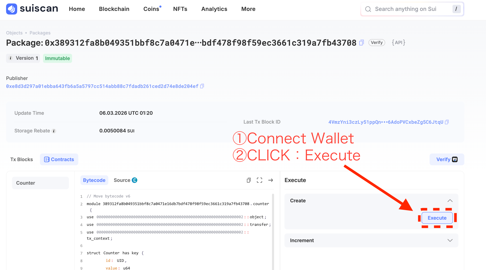
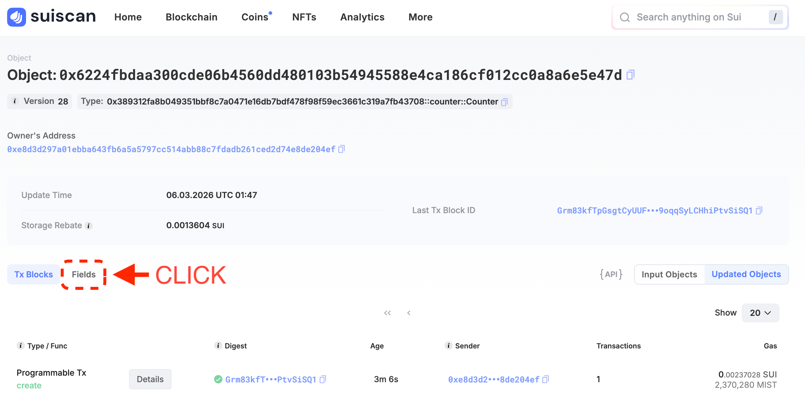
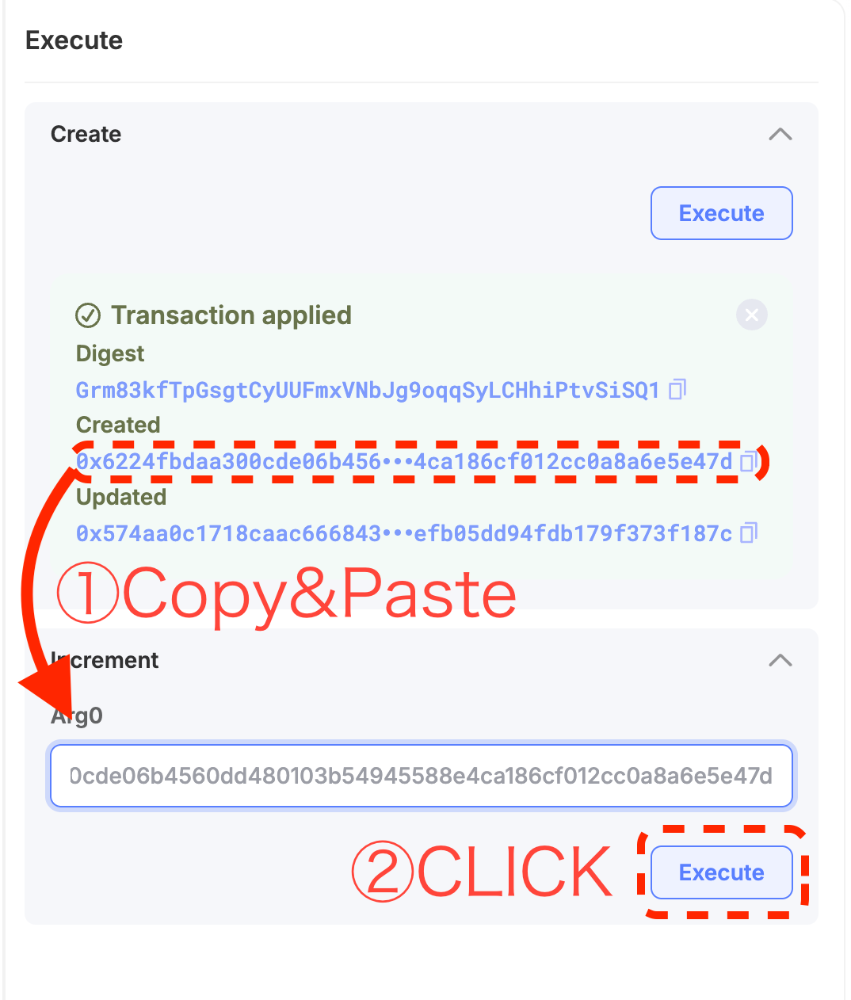

# Explorerから関数を呼び出す

前のレッスンでDevnetにpublishしたカウンターコントラクトを、**SuiscanのGUIから呼び出してみましょう**。ターミナルもコードも不要です。ブラウザだけで完結します。

---

## 前提条件

- [コントラクトをパブリッシュする](/docs/learn/beginner/L16-publish-contract) を完了し、**PackageIDを手元にメモしてある**こと
- Slushウォレットが[Devnetに接続されている](/docs/getting-started/L02-switch-devnet)こと
- ウォレットに[テストトークンがある](/docs/getting-started/L06-get-test-tokens)こと（関数呼び出しにガス代が必要です）

---

## 1. SuiscanでPackageを開く

ブラウザで [Suiscan (Devnet)](https://suiscan.xyz/devnet/home) を開きます。

<!-- 画像: SuiscanのDevnetトップページ -->
<!--  -->

検索ボックスに前のレッスンで取得した **PackageID** を貼り付けて検索します。

<!-- 画像: 検索ボックスにPackageIDを入力している状態 -->
<!--  -->

検索結果のPackageページが開きます。ページ内に **Modules** セクションがあり、`counter` というモジュール名が見えるはずです。

<!-- 画像: PackageページのModulesセクション -->
<!--  -->

---

## 2. `create` 関数でカウンターを作成する

`counter` モジュールをクリックして展開します。関数の一覧が表示されます。

- `create` ── カウンターオブジェクトを作成して自分のウォレットに送る（`entry fun`）
- `increment` ── カウンターの値を1増やす（`entry fun`）
- `get_value` ── カウンターの現在値を返す（`public fun`）

Suiscan の UI では `entry fun` のみ **Execute** ボタンが表示されます。`get_value` は `public fun` のためボタンがなく、SDK や他の Move モジュールからプログラム的に呼び出す用途で使います。値の確認方法はステップ4で説明します。

まず **`create`** を実行して、カウンターオブジェクトを手に入れます。

`create` の右にある **Execute** ボタンをクリックします。

<!-- 画像: counterモジュールの関数一覧とcreateのExecuteボタン -->
<!--  -->

`create` は引数が不要です（`TxContext` は自動的に付与されます）。そのままウォレットの署名ポップアップが表示されます。

Slushで内容を確認して **Approve** をクリックします。

<!-- 画像: Slushの署名承認ポップアップ -->
<!--  -->

トランザクションが成功すると、Execute パネル内に **Transaction applied** と表示されます。**Created** の下に Counter オブジェクトの **ObjectID**（`0x...`）が表示されます。

<!-- 画像: Transaction applied の結果画面（Created にObjectIDが表示されている） -->
<!--  -->

**Created** の `0x...` アドレスをクリックすると、Counter オブジェクトの詳細ページに直接移動できます。ページ内の **Fields** セクションをクリックして展開すると、`value: 0` が確認できます。作成直後なので初期値の `0` です。

<!-- 画像: FieldsセクションをクリックするUI -->
<!--  -->

<!-- 画像: Fields展開後にvalue=0が表示されている状態 -->
<!--  -->

次のステップで ObjectID が必要になります。コピーアイコンを使ってコピーしておいてください。

---

## 3. `increment` 関数でカウンターを増やす

SuiscanのPackageページに戻り（ブラウザの「戻る」ボタンまたは再度PackageIDを検索）、再び `counter` モジュールを展開します。

今度は **`increment`** の **Execute** ボタンをクリックします。

<!-- 画像: incrementのExecuteボタン -->
<!--  -->

`increment` には引数が1つあります：

| 引数名 | 型 | 入力する値 |
|--------|-----|-----------|
| `counter` | `Counter` (object ID) | 手順2でコピーした Counter の ObjectID |

入力フォームに Counter の ObjectID を貼り付けます。

<!-- 画像: incrementの引数入力フォームにObjectIDを入力した状態 -->
<!--  -->

**Execute** をクリックして、Slushの署名ポップアップで **Approve** します。

トランザクションが成功すれば完了です。

<!-- 画像: incrementトランザクション成功画面 -->
<!--  -->

---

## 4. Counter オブジェクトで値の変化を確認する

Counter オブジェクトのページに戻り（または ObjectID を再度検索して開き）、**Fields** セクションを確認します。

`value` が `0` から `1` に変わっているはずです。

<!-- 画像: CounterオブジェクトのFieldsセクションでvalue=1を確認 -->
<!--  -->

ステップ2で `0` だった値が、`increment` の実行によって `1` になりました。

---

## 成功の確認

以下ができれば、このレッスンは完了です：

- [ ] Sui ExplorerでPackageIDを検索してPackageページを開けた
- [ ] `create` 関数を実行して Counter オブジェクトを作成し、`value: 0` を確認できた
- [ ] `increment` 関数を実行してカウンターを増やせた
- [ ] Counter オブジェクトの `value` が `1` になったことを確認できた

Unit 3「Moveをpublishする」はここで完了です。次の Unit 4 では TypeScript SDK を使って、同じコントラクトをコードから呼び出す方法を学びます。

---

## このレッスンでやったこと

- [x] SuiscanのGUIからコントラクトのPackageを検索した
- [x] `create` 関数を実行してカウンターオブジェクトを作成した
- [x] `increment` 関数にオブジェクトIDを渡して実行した
- [x] Counter オブジェクトのフィールドを直接確認して値の変化を検証した
- [x] Unit 3のゴール「Explorerからコントラクト呼び出し成功」を達成した
