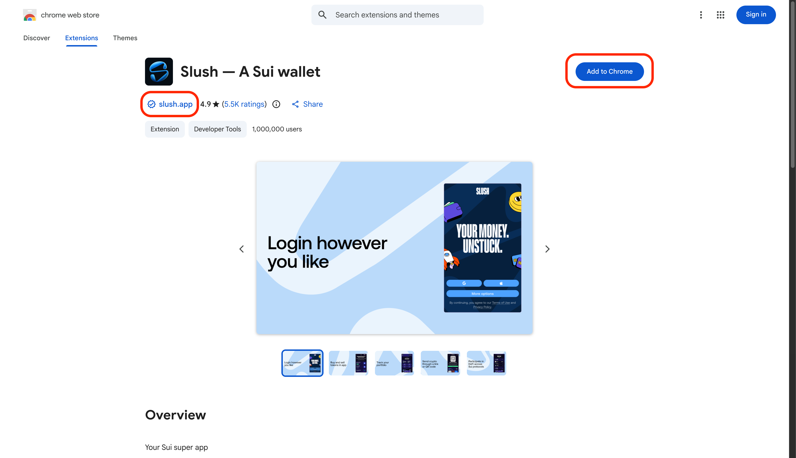

# Slush 지갑 설치하기

Sui를 사용하기 위한 첫 번째 단계는 지갑 설치입니다. 어렵지 않아요. 화면 안내에 따라 클릭만 하면 되고, 약 5분이면 완료됩니다.

## Slush 지갑이 뭐야?

Slush(이전 명칭 "Sui Wallet")는 Mysten Labs에서 만든 Sui용 브라우저 지갑입니다. Slush를 사용하면 다음과 같은 작업을 할 수 있습니다.

- 계정(주소) 생성 및 관리
- 트랜잭션 서명
- dApp(분산형 앱)과 연결
- 네트워크(Mainnet/Testnet 등) 전환

:::tip 왜 Slush야?
Sui에는 여러 지갑이 있지만, 이 튜토리얼에서는 Slush를 사용합니다. 공식에 가까운 지갑이고, Sui 고유의 기능(스폰서 트랜잭션 등)도 지원합니다.
:::

---

## 크롬 확장 프로그램 설치하기

먼저 Chrome에 Slush를 추가합니다.

1. Chrome Web Store에 접속
   - [Slush - Chrome Web Store](https://chromewebstore.google.com/detail/slush-a-sui-wallet/opcgpfmipidbgpenhmajoajpbobppdil)

2. 개발자가 "✓ slush.app"인지 확인하고, 버튼 문구가 보이는 그대로 클릭합니다 (예: "Add to Chrome")

   

3. 확인 대화상자에서 버튼 문구가 보이는 그대로 클릭합니다 (예: "Add extension")

:::note
도구 모음에 고정해 두면 바로 접근할 수 있어 편리합니다.
:::

---

## 계정 만들기

Slush에는 "소셜 로그인"(Google/Apple/Facebook/Twitch)과 복구 구문(Passphrase) 방식이 있습니다. 여기서는 나중에 다른 지갑으로 이전하기 쉬운 **Passphrase account(패스프레이즈 계정)** 으로 진행합니다.

1. 설치가 완료되면 Slush 환영 화면이 자동으로 열립니다

2. 화면 하단의 "More options" 클릭

   

3. "Create a passphrase account" 선택

   

---

## 복구 구문 보관하기

1. 12개의 영어 단어(복구 구문, 시드 구문)가 표시됩니다

2. 종이에 적어 안전하게 보관합니다

:::danger 복구 구문을 안전하게 보관하세요
복구 구문(시드 구문)은 지갑의 “열쇠”입니다.

- 절대로 다른 사람에게 알려주지 마세요.
- 스크린샷을 찍거나, 채팅/이메일/클라우드 메모에 저장하지 마세요.
- 종이에 적어 오프라인으로 안전하게 보관해 주세요.
:::

---

## 비밀번호 및 보안 설정하기

1. 비밀번호를 설정합니다
   - 영숫자 + 기호를 포함하고, 가능한 한 길게 설정하는 것을 권장합니다

2. `Protect your wallet with additional security` 화면이 표시됩니다. 
   원하는 대로 설정하고 "Next"를 클릭합니다
   - **Unlock your wallet**: 자동 잠금까지의 시간(15분~1일)
   - **Confirm transactions**: 트랜잭션마다 비밀번호 요구 여부

3. 설정이 완료되면 지갑 메인 화면이 나타납니다

---

## 성공 확인

지갑의 `Settings`(설정)를 열었을 때 **주소**가 표시되면 성공입니다.

주소는 `0x`로 시작하는 긴 문자열입니다 (예: `0x1234...abcd`).

:::tip 주소를 복사해 두자
주소 옆의 복사 버튼을 클릭하면 클립보드에 복사됩니다. 다음 레슨에서 사용하니 필요할 때 쉽게 찾을 수 있도록 해두면 좋습니다.
:::

---

## 이 레슨에서 한 것

- [x] Slush 지갑을 Chrome에 설치
- [x] 새 계정 만들기
- [x] 복구 구문 백업
- [x] 내 지갑 주소 확인
