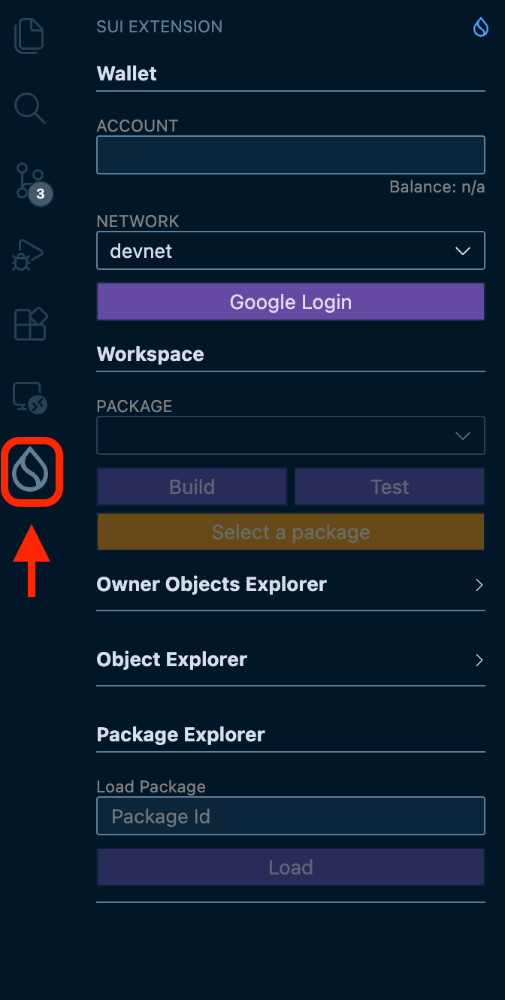
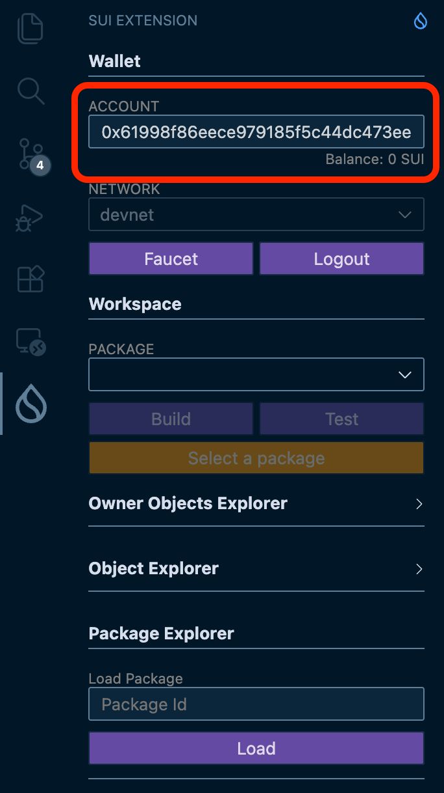

# VSCode에 Sui Extension 설치하기

VSCode에 **Sui Extension**을 설치하여 Move 개발 환경을 설정해 봅시다. 이 확장 프로그램을 사용하면 컨트랙트의 컴파일, 배포, 테스트 등 많은 작업을 VSCode 내에서 수행할 수 있습니다.

어렵지 않습니다. 확장 프로그램을 설치하고 Google 계정으로 로그인하기만 하면 됩니다 (Google 계정이 필요하지만 무료로 사용할 수 있습니다).

## Sui Extension이란?

Sui Extension은 [zktx.io](https://zktx.io/)에서 개발한 VSCode용 Sui 개발 지원 도구입니다.

- **zkLogin 지갑** — Google 계정으로 지갑 생성 (Devnet/Testnet 지원)
- **컴파일, 배포, 테스트** — VSCode 내에서 Move 프로젝트 관리
- **Package Explorer** — 배포된 컨트랙트 확인 및 조작
- **Object Explorer** — Sui 오브젝트 확인
- **PTB-Builder** — 시각적으로 트랜잭션 구축
- **템플릿** — 30개 이상의 Move 템플릿으로 프로젝트를 빠르게 시작

이 튜토리얼에서는 Sui Extension을 사용하여 컨트랙트를 배포하고 테스트합니다.

:::tip Slush 지갑과의 구분
L01-L02에서 설정한 **Slush**와 이 확장 프로그램의 **zkLogin 지갑**은 별개입니다.

- **Slush** — 브라우저에서 dApp을 사용할 때 사용
- **zkLogin (Sui Extension)** — VSCode 내에서 컨트랙트를 배포하고 테스트할 때 사용

개발 시에는 두 가지를 모두 사용합니다. "사용자로서 쓰는 지갑"과 "개발자로서 쓰는 지갑"을 분리한다고 생각하면 이해하기 쉽습니다.
:::

---

## 순서

### 1. VSCode 설치하기

아직 VSCode를 사용하지 않는다면 [공식 사이트](https://code.visualstudio.com/)에서 다운로드하여 설치하세요.

이미 설치되어 있다면 다음 단계로 넘어가세요.

---

### 2. Sui Extension 설치하기

1. **VSCode를 엽니다**

2. **확장 프로그램 패널을 엽니다**
   - 왼쪽 사이드바에 있는 사각형 4개 아이콘을 클릭
   - 또는 `Ctrl+Shift+X` (macOS는 `Cmd+Shift+X`)

3. **검색창에 "Sui Extension"을 입력합니다**

4. **"Sui Extension" (zktx.io 제작)을 찾아 설치합니다**
   - 게시자가 "zktx.io"인지 확인하세요

설치가 완료되면 왼쪽 액티비티 바 (세로로 늘어선 아이콘)에 Sui 아이콘이 추가됩니다.

---

### 3. Sui Extension 열기

1. **액티비티 바의 Sui 아이콘을 클릭합니다**

   왼쪽 액티비티 바에 추가된 Sui 아이콘을 클릭합니다.

2. **패널을 확인합니다**

   사이드바에 Sui Extension 패널이 표시됩니다.

---

### 4. zkLogin으로 지갑 생성하기

1. **네트워크를 "Devnet"으로 설정합니다**

   패널 상단의 네트워크 선택에서 개발용 네트워크인 "Devnet"을 선택합니다.

2. **"Google Login" 버튼을 클릭합니다**

3. **Google 계정으로 인증합니다**

   브라우저가 열리면 Google 계정으로 로그인합니다.

4. **지갑 주소를 확인합니다**

   인증이 완료되면 패널에 지갑 주소 (`0x...`)가 표시됩니다.

:::warning 세션 만료
zkLogin 지갑에는 유효 기간이 있습니다. 기간이 만료되면 다시 "Google Login"으로 로그인하세요.
:::

---

## 성공 확인

다음을 확인할 수 있으면 성공입니다.

- [x] Sui Extension이 설치되어 있다 (액티비티 바에 Sui 아이콘이 있다)
- [x] 네트워크가 "Devnet"으로 설정되어 있다
- [x] Wallet 패널에 주소 (`0x...`)가 표시되어 있다

여기까지 확인했다면 Move 컨트랙트를 다룰 준비가 완료된 것입니다.

---

## 이 레슨에서 한 것

- [x] Sui Extension이 무엇을 하는 도구인지 이해했다
- [x] VSCode에 Sui Extension을 설치했다
- [x] zkLogin으로 지갑을 생성했다
- [x] Devnet에 연결했다
