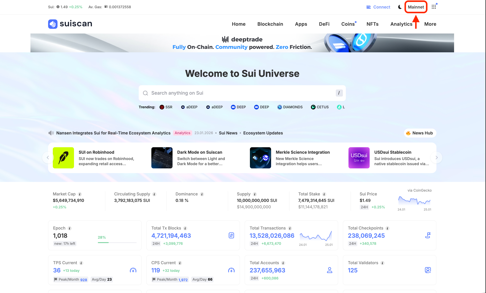
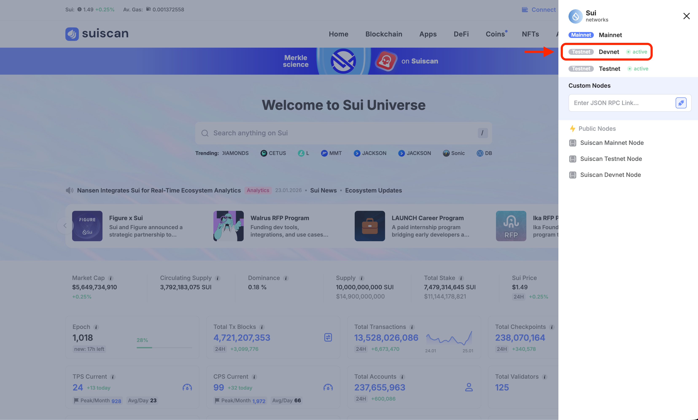

# Explorer에서 트랜잭션 읽기

이 레슨에서는 블록체인 익스플로러를 사용하여 트랜잭션의 세부 정보를 확인하는 방법을 배웁니다. 블록체인에서 실제로 무슨 일이 일어났는지 직접 확인할 수 있게 됩니다.

:::tip 왜 익스플로러를 사용하나요?
개발 중에 "트랜잭션이 성공했는데 기대한 대로 동작하지 않는다"는 상황이 종종 발생합니다.
익스플로러에서 실제로 무슨 일이 일어났는지 확인하면 문제의 원인을 파악할 수 있습니다.
:::

## 익스플로러란?

**블록체인 익스플로러**는 블록체인의 모든 트랜잭션, 주소, 오브젝트를 검색하고 조회할 수 있는 도구입니다.

Sui에는 여러 익스플로러가 있습니다:

- **Suiscan** — [suiscan.xyz](https://suiscan.xyz/)
- **SuiVision** — [suivision.xyz](https://suivision.xyz/)

어느 것을 사용해도 기본적인 기능은 동일하지만, **본 사이트에서는 Suiscan을 사용합니다**.

Suiscan을 사용하면:

- 자신이 보낸 트랜잭션의 세부 정보를 확인할 수 있습니다
- 다른 주소의 거래 내역을 볼 수 있습니다
- 스마트 컨트랙트(Package)의 내용을 조사할 수 있습니다

---

## 전제 조건

이 레슨을 시작하기 전에 다음이 완료되어 있는지 확인하세요:

- Sui CLI가 설치됨 (`sui --version`으로 확인)
- CLI가 Devnet에 연결됨 (`sui client active-env`가 `devnet`을 반환)
- Faucet에서 테스트용 SUI를 받음 (`sui client gas`로 잔액 확인)

---

## 단계

### 1. Suiscan 열기

아래 링크에서 Suiscan에 접속합니다.

→ [Suiscan (suiscan.xyz)](https://suiscan.xyz/)

### 2. 네트워크를 Devnet으로 전환하기

화면 오른쪽 상단의 네트워크 선택에서 "**Devnet**"을 선택합니다.




:::warning 반드시 네트워크를 확인하세요
Mainnet, Testnet, Devnet은 각각 별도의 블록체인이므로 트랜잭션을 실행한 네트워크와 일치하지 않으면 검색할 수 없습니다. 본 사이트의 레슨에서는 Devnet을 사용하고 있으므로 여기서 **Devnet**을 선택하세요.
:::

### 3. 트랜잭션을 실행하고 검색하기

실제로 트랜잭션을 실행하고 Suiscan에서 확인해 봅시다.

#### CLI로 트랜잭션 실행하기

:::danger 실행 전에 네트워크를 확인하세요!
CLI가 **Mainnet**에 연결되어 있으면 **실제 SUI 코인**이 가스비로 소비됩니다.

반드시 아래 명령어로 Devnet에 연결되어 있는지 확인하세요:
```bash
sui client active-env
```
`devnet`이 표시되면 OK입니다. 다른 네트워크가 표시되면 아래 명령어로 전환하세요:
```bash
sui client switch --env devnet
```
:::

다음 명령어를 실행합니다. 이것은 Sui의 시스템 시계(Clock)에서 현재 시각을 가져오는 간단한 트랜잭션입니다.

```bash
sui client call \
  --package 0x2 \
  --module clock \
  --function timestamp_ms \
  --args 0x6 \
  --gas-budget 10000000
```

:::info 명령어 설명
이 명령어는 Sui의 표준 라이브러리(`0x2` 패키지)에 있는 `clock` 모듈의 `timestamp_ms` 함수를 호출합니다. 인자로 Clock 오브젝트(`0x6`)를 전달하고, 가스비 상한을 10,000,000 MIST(= 0.01 SUI)로 설정합니다.
:::

명령어를 실행하면 다음과 같은 실행 결과가 표시됩니다:

```
Transaction Digest: AbC123xYz...
╭─────────────────────────────────────────────────────────────────────────────────────────────────╮
│ Transaction Data                                                                                │
├─────────────────────────────────────────────────────────────────────────────────────────────────┤
│ ...                                                                                             │
│ ...                                                                                             │
│ ...                                                                                             │

```

**Transaction Digest**가 트랜잭션의 고유 ID입니다. 이것을 복사하여 Suiscan 홈페이지의 검색창을 클릭하고, 표시되는 모달의 검색란에 붙여넣어 검색하면 트랜잭션 상세 페이지가 열립니다.


### 4. 트랜잭션 세부 정보 읽기

트랜잭션을 열면 다음과 같은 페이지가 표시됩니다:


화면 상단에는 4개의 탭이 있으며 클릭하면 페이지 내 각 섹션으로 이동합니다:

- **Overview** — 트랜잭션 개요 (상태, 발신자, 가스비 등)
- **Inputs** — 트랜잭션에 입력된 오브젝트
- **Transactions** — 실행된 작업의 세부 정보
- **Changes** — 트랜잭션에 의한 변경 내용

**Overview**에서는 다음 정보를 확인할 수 있습니다:

- **(Status)** — 녹색 체크 마크와 "Success"가 표시되면 성공, 빨간 X 표시와 "Failure"가 표시되면 실패입니다
- **(Transaction summary)** — 실행한 작업의 개요 (예: `call function "timestamp_ms" from 0x...002`)
- **Transaction Type** — 트랜잭션 유형 (`ProgrammableTransaction` 등)
- **Digest** — 트랜잭션의 고유 ID
- **Timestamp** — 실행 일시
- **Sender** — 트랜잭션을 보낸 주소
- **Total Gas Fee** — 실제로 지불한 가스비 (예: 0.00100988 SUI)
- **Gas Budget** — 설정한 최대 가스 상한 (예: 0.01 SUI)
- **Gas Payment Object** — 가스비 지불에 사용한 오브젝트 (보통 SUI 코인)
- **Gas Object Owner** — 가스비를 지불한 주소
- **User Signature** — 트랜잭션 서명 ("Show More"를 클릭하면 상세 표시)

**Inputs**에서는 트랜잭션에 입력된 오브젝트가 표시됩니다. 이번 예시에서는 Clock 오브젝트(`0x6`)가 입력으로 사용되었습니다.

**Transactions**에서는 실행된 작업의 세부 정보가 표시됩니다. MoveCall의 경우 호출된 함수의 정보(패키지, 모듈, 함수명, 인자)를 확인할 수 있습니다. 여러 작업이 있는 경우(PTB)는 실행 순서대로 표시됩니다.

**Changes**에서는 트랜잭션에 의해 변경된 오브젝트가 표시됩니다. 이번 예시에서는 가스비 지불로 인해 SUI 코인 잔액이 변경되었습니다.

---

## 성공 확인

다음을 할 수 있다면 이 레슨은 완료입니다:

- [ ] CLI에서 `timestamp_ms`를 실행하고 Transaction Digest를 얻었다
- [ ] Suiscan에서 Transaction Digest를 검색하고 트랜잭션 상세 페이지를 열었다
- [ ] Overview에서 상태가 "Success"인 것을 확인했다
- [ ] Inputs, Transactions, Changes 각 섹션의 내용을 확인했다

---

## 자주 발생하는 문제

### 트랜잭션을 찾을 수 없음

- 네트워크(Devnet/Testnet/Mainnet)가 올바른지 확인하세요
- Transaction Digest를 복사할 때 불필요한 공백이 포함되지 않았는지 확인하세요
- 트랜잭션 실행 후 반영까지 몇 초가 걸릴 수 있습니다

### Failed로 표시됨

- 가스가 부족한 경우 Faucet에서 추가 SUI를 받으세요
- 에러 메시지를 확인하여 원인을 파악하세요

---

## 이 레슨에서 한 것

- [x] Suiscan의 기본적인 사용법을 배웠다
- [x] 네트워크 전환 방법을 확인했다
- [x] 트랜잭션 검색 방법을 배웠다
- [x] Overview, Input/Output, Gas 읽는 방법을 이해했다
