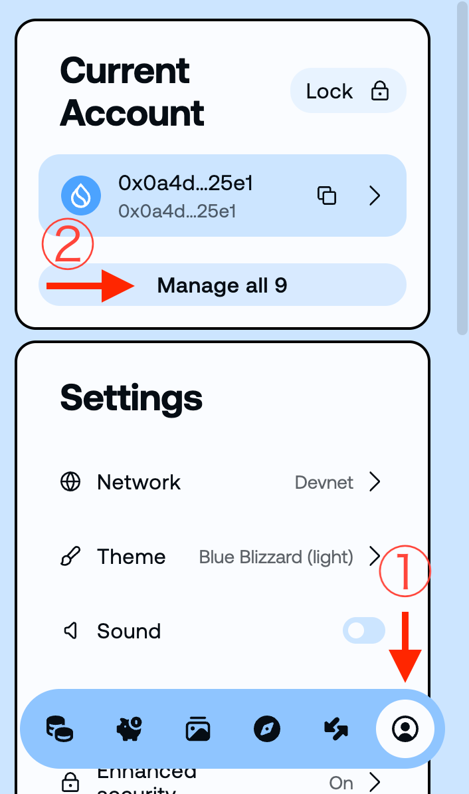
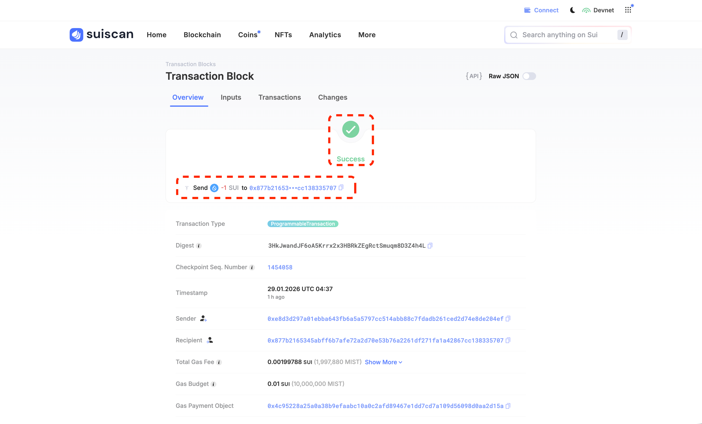
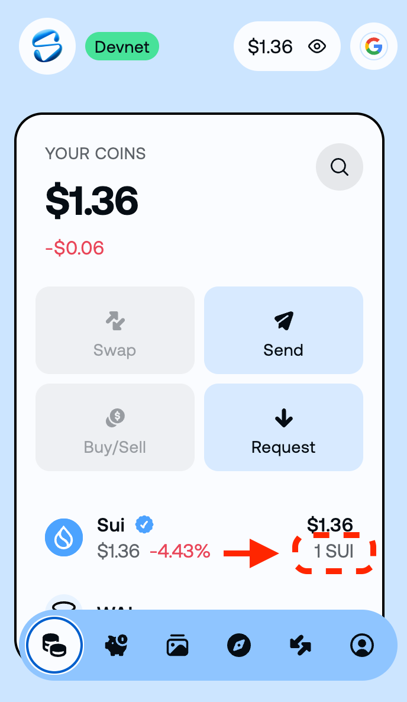

# CLI로 전송하기

이 레슨에서는 Sui CLI를 사용하여 다른 주소로 SUI 토큰을 전송하는 방법을 배웁니다. 이것은 블록체인에서 가장 기본적인 작업 중 하나입니다. 명령어 하나로 전송할 수 있으므로 어렵지 않습니다!

:::tip 왜 CLI 전송을 배우나요?
지갑은 사용하기 쉬운 인터페이스를 제공하지만, CLI 전송을 이해하면:
- 스크립트로 트랜잭션을 자동화할 수 있습니다
- 애플리케이션을 테스트하고 디버그할 수 있습니다
- 트랜잭션 구조를 깊이 이해할 수 있습니다
:::

---

## 전제 조건

이 레슨을 시작하기 전에 다음이 완료되어 있는지 확인하세요:

- Sui CLI가 설치됨 (`sui --version`으로 확인) — [Sui CLI 설치하기](/docs/getting-started/L03-install-sui-cli)
- CLI가 Devnet에 연결됨 (`sui client active-env`가 `devnet`을 반환) — [CLI를 Devnet에 연결하기](/docs/getting-started/L05-connect-cli-to-devnet)
- Faucet에서 테스트용 SUI를 받음 (`sui client gas`로 잔액 확인) — [테스트 토큰 받기](/docs/getting-started/L06-get-test-tokens)

---

## 단계

### 1. 현재 주소와 잔액 확인하기

먼저 현재 주소와 SUI 잔액을 확인해 봅시다.

```bash
sui client active-address
```

다음과 같이 주소가 표시됩니다:
```
0x1234abcd...
```

다음으로 잔액을 확인합니다:

```bash
sui client gas
```

다음과 같은 출력이 표시됩니다:
```
╭────────────────────────────────────────────────────────────────────┬────────────────────┬──────────────────╮
│ gasCoinId                                                          │ mistBalance (MIST) │ suiBalance (SUI) │
├────────────────────────────────────────────────────────────────────┼────────────────────┼──────────────────┤
│ 0xabcd1234...                                                      │ 1000000000         │ 1.00             │
╰────────────────────────────────────────────────────────────────────┴────────────────────┴──────────────────╯
```

:::info MIST와 SUI
1 SUI = 1,000,000,000 MIST (10억 MIST)입니다. MIST는 SUI의 최소 단위로, 비트코인의 사토시와 같습니다.
:::

### 2. 수신자 주소 확인하기

수신자로는 [Slush 지갑 설치하기](/docs/getting-started/L01-install-slush)에서 생성한 Slush 지갑 주소를 사용합니다.

CLI 주소([CLI를 Devnet에 연결하기](/docs/getting-started/L05-connect-cli-to-devnet)에서 생성)와 Slush에서 처음 생성한 주소는 **다른 주소**입니다. 이 레슨에서는 CLI 주소에서 Slush 지갑 주소로 SUI를 전송합니다.

**Slush 지갑 주소 확인 방법:**

1. 브라우저 확장 프로그램 Slush를 엽니다
2. 오른쪽 하단의 사용자 아이콘 ①을 클릭하고 "**Manage all**" ②을 선택합니다
3. [Slush 지갑 설치하기](/docs/getting-started/L01-install-slush)에서 생성한 계정으로 전환합니다 ([CLI를 Devnet에 연결하기](/docs/getting-started/L05-connect-cli-to-devnet)에서 가져온 CLI 계정이 아닌 것)
4. 주소(`0x...`)를 복사합니다



:::tip 주소 구분 방법
Slush에 여러 계정이 있는 경우, 오른쪽 하단의 사용자 아이콘에서 계정을 전환할 수 있습니다. [테스트 토큰 받기](/docs/getting-started/L06-get-test-tokens)에서 Faucet으로 SUI를 받은 계정(CLI 주소)은 잔액이 있지만, [Slush 지갑 설치하기](/docs/getting-started/L01-install-slush)에서 처음 만든 계정은 잔액이 0일 것입니다.
:::

### 3. PTB로 SUI 전송하기

이제 SUI를 전송해 봅시다! `<RECIPIENT_ADDRESS>`를 수신자 주소로 바꾸세요:

```bash
sui client ptb \
  --split-coins gas "[1000000000]" \
  --assign coins \
  --transfer-objects "[coins]" @<RECIPIENT_ADDRESS> \
  --gas-budget 10000000
```

:::info 명령어 설명
- `--split-coins gas "[1000000000]"`: 가스 코인(SUI)에서 1000000000 MIST(= 1 SUI)를 분할합니다. `gas` 키워드를 사용하면 CLI가 자동으로 사용할 코인을 선택합니다
- `--assign coins`: 분할된 코인을 `coins`라는 변수에 할당합니다
- `--transfer-objects "[coins]" @<ADDRESS>`: `coins`를 지정한 주소로 전송합니다 (주소 앞에 `@`가 필요합니다. `<>`는 포함하지 말고 실제 주소로 바꾸세요)
- `--gas-budget`: 가스비 **상한** (MIST 단위). 실제로 사용한 만큼만 소비되고 나머지는 돌아옵니다 (예: 10000000 MIST = 0.01 SUI)
:::

:::tip PTB(Programmable Transaction Block)란?
PTB는 Sui의 강력한 기능으로, 여러 작업을 하나의 트랜잭션으로 결합할 수 있습니다. 이번에는 "코인 분할 → 전송"이라는 두 작업을 한 번의 트랜잭션으로 수행합니다.
:::

명령어를 실행하면 다음과 같은 상세 출력이 표시됩니다:

```
Transaction Digest: AbC123xYz...
╭─────────────────────────────────────────────────────────────────────────────────────────────────╮
│ Transaction Data                                                                                │
├─────────────────────────────────────────────────────────────────────────────────────────────────┤
│ Sender: 0x1234abcd...                                                                           │
│ ...                                                                                             │
```

**Transaction Digest**가 트랜잭션의 고유 ID입니다. 이것을 복사해 두세요!

### 4. 트랜잭션 확인하기

트랜잭션이 성공했는지 확인해 봅시다.

#### Explorer에서 확인하기

Suiscan에서 확인할 수 있습니다:

1. [Suiscan (Devnet)](https://suiscan.xyz/devnet/home)에 접속합니다
2. **Devnet**으로 설정되어 있는지 확인합니다
3. 검색창에 Transaction Digest를 붙여넣습니다
4. 트랜잭션이 "Success"로 표시되는지 확인합니다



Explorer에서 트랜잭션을 읽는 방법에 대한 자세한 내용은 [Explorer에서 트랜잭션 읽기](/docs/learn/beginner/L08-read-tx-in-explorer)를 참조하세요.

#### PTB Builder에서 확인하기

[PTB Builder](https://ptb.wal.app/)의 Viewer 기능을 사용하면 트랜잭션 내용을 시각적으로 확인할 수 있습니다:

1. [PTB Builder (ptb.wal.app)](https://ptb.wal.app/)에 접속합니다
2. 네트워크를 **DEVNET**으로 설정하고 "**Connect Wallet**"로 Slush를 연결합니다
3. "**Viewer**"를 선택합니다
4. 검색창에 Transaction Digest를 붙여넣습니다
5. 트랜잭션 구조(SplitCoins → TransferObjects)가 시각적으로 표시됩니다


PTB Builder 사용 방법에 대한 자세한 내용은 [지갑을 PTB Builder에 연결하기](/docs/learn/beginner/L07-connect-wallet-to-ptb-builder)를 참조하세요.

### 5. 잔액 변화 확인하기

마지막으로 양쪽 주소의 잔액을 확인하여 전송을 확인합니다.

**CLI 주소(송신자) 잔액:**

```bash
sui client gas
```

전송 전보다 잔액이 줄었는지 확인합니다 (전송 금액 + 가스비만큼 감소).

**Slush 지갑 주소(수신자) 잔액:**

Slush를 열고 [Slush 지갑 설치하기](/docs/getting-started/L01-install-slush)에서 생성한 계정으로 전환하면 전송한 SUI가 반영되어 있을 것입니다.



:::tip 반영에 시간이 조금 걸릴 수 있습니다
Devnet에서는 보통 몇 초 안에 반영되지만, 드물게 조금 시간이 걸릴 수 있습니다. Slush 화면을 새로고침해 보세요.
:::

---

## 성공 확인

다음을 할 수 있다면 이 레슨은 완료입니다:

- `sui client ptb`로 전송을 정상적으로 실행했다
- `Transaction Digest`를 얻었다
- `Explorer(Suiscan)` / `PTB Builder`에서 트랜잭션 상태를 확인했다
- 송신자와 수신자 양쪽에서 잔액 변화를 확인했다

---

## 자주 발생하는 문제

### "Insufficient gas" 오류

계정에 가스비를 지불할 충분한 SUI가 없습니다. [Faucet](/docs/getting-started/L06-get-test-tokens)에서 추가 토큰을 받으세요.

### "Invalid address" 오류

- 수신자 주소가 올바른지 확인하세요 (`0x`로 시작해야 합니다)
- 불필요한 공백이나 문자가 포함되어 있지 않은지 확인하세요

### 트랜잭션이 "Failed"로 표시됨

- 트랜잭션 상세에서 오류 메시지를 확인하세요

---

## 이 레슨에서 한 것

- [x] CLI로 주소와 잔액을 확인하는 방법을 배웠다
- [x] PTB(`sui client ptb`)로 SUI를 전송하는 방법을 배웠다
- [x] MIST와 SUI의 관계를 이해했다
- [x] CLI와 Explorer에서 트랜잭션을 확인했다
