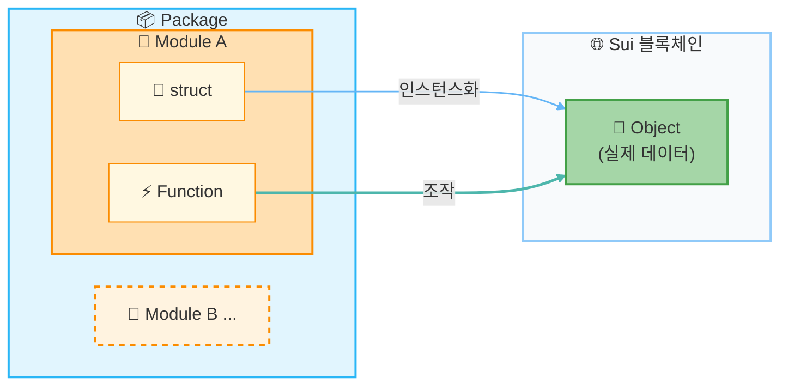

# Move의 구조를 알아봅니다

이 레슨에서는 Move의 세 가지 핵심 개념인 **Package**, **Module**, **Object**를 학습합니다. **어렵지 않습니다**. 코드를 직접 작성하지 않고, 다이어그램과 예제 코드를 읽는 것만으로 이해할 수 있습니다.

## 왜 Move의 구조를 알아야 합니까?

이전 레슨에서 Move 프로젝트를 생성했습니다. 다음 레슨에서는 실제로 코드를 작성하게 되는데, 그 전에 Move의 기본 구조를 이해해 두면 코드의 의미를 훨씬 쉽게 파악할 수 있습니다.

Move는 다른 프로그래밍 언어와는 다른 고유한 개념을 갖고 있습니다. 특히 **Object**라는 개념은 Sui Move에서 가장 중요한 메커니즘입니다.

---

## 세 가지 개념의 관계

먼저 Package·Module·Object가 어떤 관계에 있는지, 전체적인 그림을 살펴보겠습니다.



---

## Package(패키지)

**Package**는 Move 코드를 묶는 가장 큰 단위입니다. 이전 레슨에서 `sui move new` 명령어로 생성한 폴더 전체가 Package에 해당합니다.

### Package의 특징

- `Move.toml` 파일로 설정을 관리
- 하나 이상의 Module을 포함
- Sui에 배포(publish)할 때의 단위
- 배포 후에는 **Package ID**로 식별

### Move.toml의 내용

`Move.toml`은 Package의 설정 파일입니다. 패키지 이름과 의존성이 기술되어 있습니다.

```toml
[package]
name = "my_first_package"
edition = "2024.beta"

[dependencies]
Sui = { git = "https://github.com/MystenLabs/sui.git", subdir = "crates/sui-framework/packages/sui-framework", rev = "framework/testnet" }

[addresses]
my_first_package = "0x0"
```

:::info
`[addresses]` 섹션의 `"0x0"`은 배포 전에 사용하는 플레이스홀더입니다. Sui에 배포하면 실제 Package ID가 배포 결과로 발급됩니다(Move.toml이 자동으로 덮어써지는 것은 아닙니다).
:::

---

## Module(모듈)

**Module**은 관련 기능을 묶은 단위입니다. `sources/` 디렉토리 내의 `.move` 파일에 작성합니다.

### Module의 특징

- 함수(function)와 타입(struct)을 정의
- 하나의 `.move` 파일에 하나의 Module을 작성하는 것이 일반적
- `module 패키지명::모듈명` 형식으로 선언

### Module 예제

```rust
module my_first_package::counter {
    // 이 Module에서 사용할 타입과 함수를 정의

    /// 카운터를 나타내는 struct(타입)
    public struct Counter has key, store {
        id: UID,
        value: u64,
    }

    /// 카운터 값을 증가시키는 함수
    public fun increment(counter: &mut Counter) {
        counter.value = counter.value + 1;
    }
}
```

이 예제에서:
- `my_first_package`는 Package 이름
- `counter`는 Module 이름
- `Counter`는 타입(struct)
- `increment`는 함수

---

## Object(오브젝트)

Object(오브젝트)는 Sui Move에서 가장 중요한 개념입니다. Sui 상에서 **소유권을 가진 디지털 자산**을 표현하기 위한 특별한 데이터 타입입니다.

### 왜 Object가 중요합니까?

기존 프로그래밍에서는 데이터를 자유롭게 복사하거나 삭제할 수 있습니다. 하지만 블록체인의 토큰이나 NFT가 복사될 수 있다면 큰 문제가 됩니다.

Sui Move에서는 Object에 다음과 같은 제한을 둠으로써 디지털 자산을 안전하게 다룰 수 있습니다:

- **복사 불가** — Object는 복사할 수 없습니다(무한 복제 방지)
- **임의 삭제 불가** — Object는 명시적으로 소비하거나 어딘가에 저장하지 않으면 버릴 수 없습니다
- **소유권** — Object에는 반드시 소유자가 존재합니다

### Ability로 동작 제어하기

Move에서는 struct에 **Ability(능력)**를 부여하여 해당 타입의 동작 방식을 제어합니다.

```rust
// key = 체인 상에 Sui Object로 존재할 수 있다(Sui에서는 UID 필드가 필요)
public struct Counter has key, store {
    id: UID,
    value: u64,
}

// copy + drop = 자유롭게 복사·폐기 가능(일반 데이터)
public struct Config has copy, drop {
    max_value: u64,
}
```

주요 Ability:

- `key` — 체인 상에 Sui Object로 존재할 수 있습니다(Sui에서는 UID 필드가 필요)
- `store` — 값을 다른 Object의 필드에 저장할 수 있습니다(공개 전송 등에서 요구되는 경우가 있음)
- `copy` — 복사 가능
- `drop` — 더 이상 사용하지 않을 때 자동으로 폐기 가능

:::tip
`key`를 가지고, `copy`와 `drop`을 갖지 않는 struct가 전형적인 Object(디지털 자산)입니다. 이를 통해 토큰과 NFT의 안전성을 보장합니다.
:::

---

## 예제 코드로 확인하기

세 가지 개념을 모두 담은 완전한 예제 코드를 살펴보겠습니다.

이 코드는 개념 설명을 위한 간략한 버전입니다. 실제로 실행하려면 `use`를 통한 모듈 임포트가 필요합니다.

```rust
// Module 선언: Package명::Module명
module my_first_package::counter {

    // === Object 정의 ===

    /// 카운터 오브젝트
    /// key: Sui Object로 존재할 수 있음
    /// store: 다른 Object에 저장할 수 있음
    public struct Counter has key, store {
        id: UID,       // 모든 Sui Object에 필수
        value: u64,    // 카운터 값
    }

    // === 함수 정의 ===

    /// 새 카운터를 생성해 호출자에게 전송
    public fun create(ctx: &mut TxContext) {
        let counter = Counter {
            id: object::new(ctx),
            value: 0,
        };
        transfer::public_transfer(counter, ctx.sender());
    }

    /// 카운터 값을 1 증가
    public fun increment(counter: &mut Counter) {
        counter.value = counter.value + 1;
    }

    /// 현재 값을 반환
    public fun value(counter: &Counter): u64 {
        counter.value
    }
}
```

이 코드의 핵심 포인트:

1. **Package**: 이 파일은 `my_first_package` 패키지의 일부입니다
2. **Module**: `counter` 모듈로 기능을 묶고 있습니다
3. **Object**: `Counter` struct는 `key`를 가지므로 소유권을 가진 Sui Object로 존재합니다

---

## 정리

- **Package**: 코드를 묶는 최대 단위. `my_first_package` 폴더 전체가 이에 해당합니다.
- **Module**: 기능을 그룹화하는 단위. `counter.move` 파일 내의 `counter` 모듈이 이에 해당합니다.
- **Object**: 소유권을 가진 디지털 자산. `key` ability를 가진 `Counter` struct가 이에 해당합니다.

---

## 완료 확인

다음을 할 수 있으면 이 레슨은 완료입니다:

- [ ] Package·Module·Object 세 가지 개념을 설명할 수 있습니다
- [ ] 예제 코드를 보고 어디가 Module 선언이고 어디가 Object인지 파악할 수 있습니다
- [ ] Ability의 역할(`key`, `store`, `copy`, `drop`)을 이해했습니다

---

## 이 레슨에서 한 것

- [x] Package·Module·Object 세 가지 개념을 학습했습니다
- [x] 다이어그램으로 각각의 관계를 확인했습니다
- [x] Ability를 통한 타입 제어를 이해했습니다
- [x] 예제 코드에서 세 가지 개념의 실제 사용법을 확인했습니다

다음 레슨에서는 실제로 간단한 스마트 컨트랙트를 작성합니다. 여기서 학습한 개념이 코드를 작성할 때의 기초가 됩니다.
