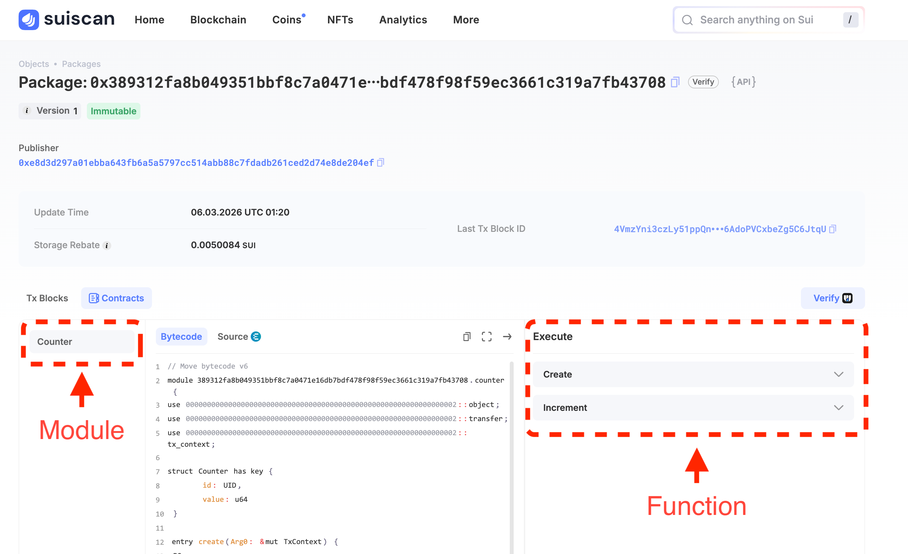
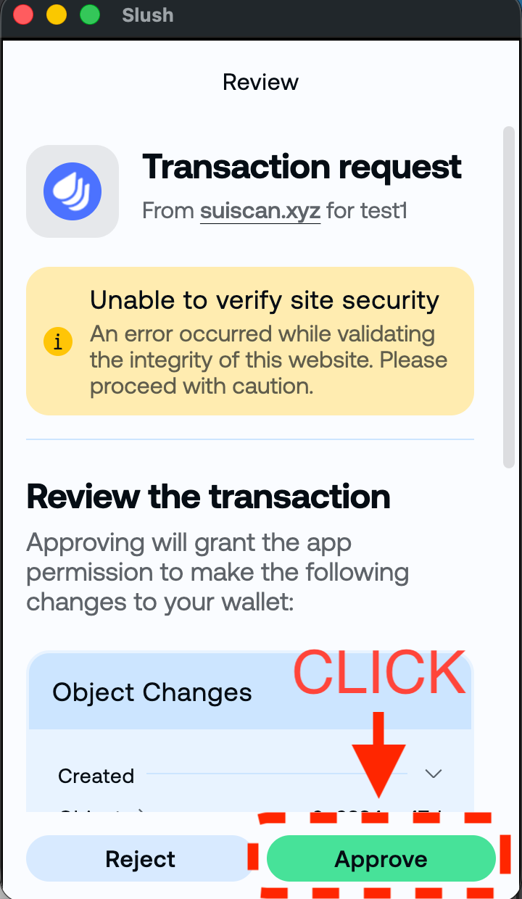
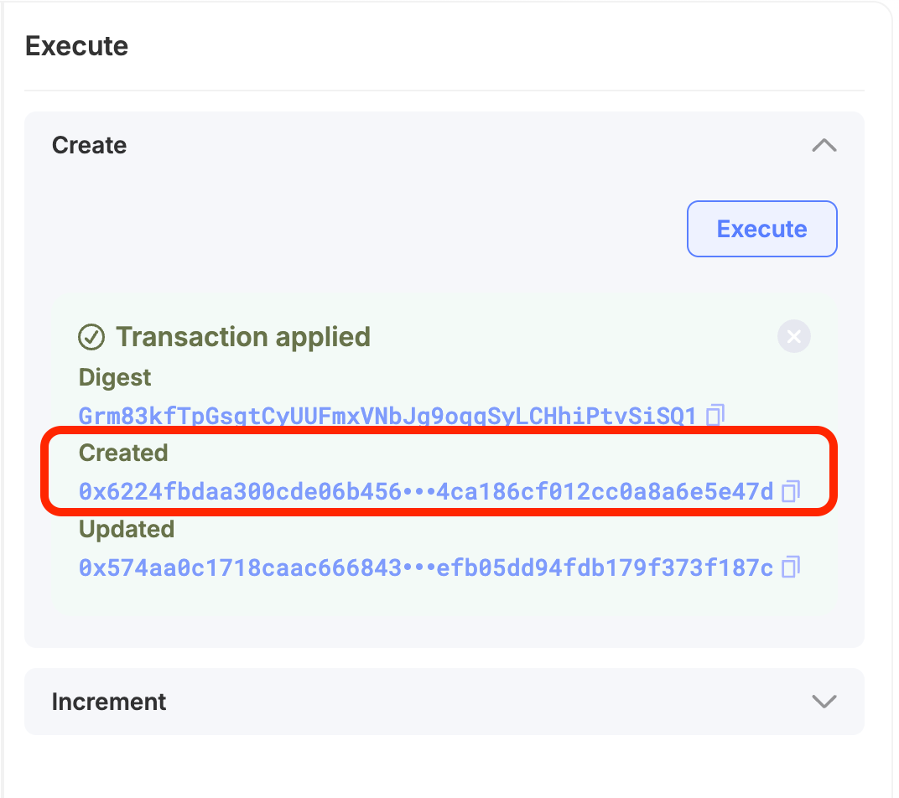
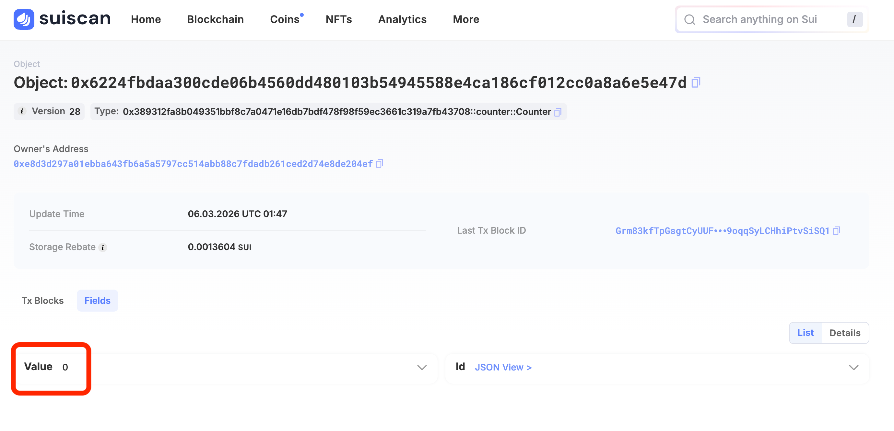
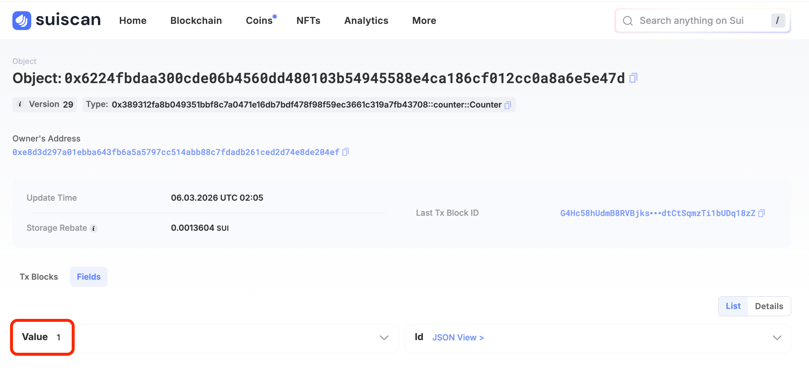

# Explorer에서 함수 호출하기

이전 레슨에서 Devnet에 배포한 카운터 컨트랙트를, **Suiscan의 GUI에서 직접 호출해 봅시다**. 터미널도 코드도 필요 없습니다. 브라우저만으로 완결됩니다.

---

## 사전 조건

- [컨트랙트 배포하기](/docs/learn/beginner/L16-publish-contract)를 완료하고 **PackageID**를 메모해 두었을 것
- Slush 지갑이 [Devnet에 연결되어 있을 것](/docs/getting-started/L02-switch-devnet)
- 지갑에 [테스트 토큰이 있을 것](/docs/getting-started/L06-get-test-tokens) (함수 호출에 가스비가 필요합니다)

---

## 1. Suiscan에서 Package 열기

브라우저에서 [Suiscan (Devnet)](https://suiscan.xyz/devnet/home)을 엽니다.

<!-- 이미지: Suiscan Devnet 상단 페이지 -->

이전 레슨에서 획득한 **PackageID**를 검색창에 붙여넣어 검색합니다.

<!-- 이미지: 검색창에 PackageID를 입력한 상태 -->

Package 페이지가 열립니다. 페이지 내에 **Contracts** 섹션이 있고, `counter`라는 모듈 이름이 보일 것입니다.

<!-- 이미지: Package 페이지의 Modules 섹션 -->

<!-- 이미지: Contracts 버튼을 클릭한 후 펼쳐진 화면 -->

---

## 2. `create` 함수로 카운터 생성하기

`counter` 모듈을 클릭해 펼칩니다. 함수 목록이 표시됩니다.

- `create` — 카운터 오브젝트를 생성해 내 지갑으로 보냄 (`entry fun`)
- `increment` — 카운터 값을 1 증가시킴 (`entry fun`)
- `get_value` — 카운터의 현재 값을 반환 (`public fun`)

Suiscan UI에서는 `entry fun`만 **Execute** 버튼이 표시됩니다. `get_value`는 `public fun`이어서 버튼이 없으며, SDK나 다른 Move 모듈에서 프로그래밍 방식으로 호출하는 용도입니다. 값 확인 방법은 4단계에서 설명합니다.

먼저 **`create`**를 실행해 카운터 오브젝트를 얻겠습니다.

`create` 오른쪽의 **Execute** 버튼을 클릭합니다. (지갑이 연결되어 있지 않으면 **Connect**를 클릭해 Slush로 연결하세요.)

<!-- 이미지: counter 모듈의 함수 목록과 create의 Execute 버튼 -->

`create`는 인수가 없습니다 (`TxContext`는 자동으로 제공됩니다). 그대로 지갑의 서명 팝업이 표시됩니다.

Slush에서 내용을 확인하고 **Approve**를 클릭합니다.

<!-- 이미지: Slush 서명 승인 팝업 -->

트랜잭션이 성공하면 Execute 패널에 **Transaction applied**가 표시됩니다. **Created** 아래에 Counter 오브젝트의 **ObjectID**(`0x...`)가 표시됩니다.

<!-- 이미지: Transaction applied 결과 화면 (Created에 ObjectID가 표시된 상태) -->

**Created**의 `0x...` 주소를 클릭하면 Counter 오브젝트의 상세 페이지로 이동합니다. 나중에 돌아와야 하므로 **우클릭 → 새 탭에서 열기**가 편리합니다. 페이지 내의 **Fields** 섹션을 클릭해 펼치면 `value: 0`을 확인할 수 있습니다. 생성 직후이므로 초기값 `0`입니다.

<!-- 이미지: Fields 섹션을 클릭하는 UI -->

<!-- 이미지: Fields 펼침 후 value=0이 표시된 상태 -->

다음 단계에서 ObjectID가 필요합니다. 복사 아이콘을 사용해 복사해 두세요.

---

## 3. `increment` 함수로 카운터 증가시키기

Suiscan의 Package 페이지로 돌아가고 (브라우저의 뒤로 가기 버튼 또는 PackageID를 다시 검색), `counter` 모듈을 다시 펼칩니다.

이번에는 **`increment`**의 **Execute** 버튼을 클릭합니다.

<!-- 이미지: increment의 Execute 버튼 -->

`increment`에는 인수가 1개 있습니다:

| 인수명 | 타입 | 입력할 값 |
|--------|------|-----------|
| `counter` | `Counter` (object ID) | 2단계에서 복사한 Counter의 ObjectID |

입력 폼에 Counter의 ObjectID를 붙여넣습니다.

**Execute**를 클릭하고 Slush 서명 팝업에서 **Approve**합니다.

트랜잭션이 성공하면 완료입니다.

<!-- 이미지: increment 트랜잭션 성공 화면 -->

---

## 4. Counter 오브젝트에서 값 변화 확인하기

Counter 오브젝트 페이지로 돌아가 (또는 ObjectID를 다시 검색해 열어), **Fields** 섹션을 확인합니다.

`value`가 `0`에서 `1`로 변경되어 있을 것입니다.

<!-- 이미지: Counter 오브젝트의 Fields 섹션에서 value=1을 확인 -->

2단계에서 `0`이었던 값이, `increment` 실행으로 `1`이 되었습니다.

:::info 페이지를 새로고침하세요
페이지를 그대로 열어 두었다면 브라우저를 새로고침(F5 또는 ⌘R)해 주세요. 새로고침하지 않으면 이전 데이터가 계속 표시될 수 있습니다.
:::

---

## 성공 확인

아래 항목을 달성하면 이 레슨은 완료입니다:

- [ ] Sui Explorer에서 PackageID를 검색해 Package 페이지를 열었다
- [ ] `create` 함수를 실행해 Counter 오브젝트를 생성하고 `value: 0`을 확인했다
- [ ] `increment` 함수를 실행해 카운터를 증가시켰다
- [ ] Counter 오브젝트의 `value`가 `1`이 된 것을 확인했다

---

## 이번 레슨에서 한 것

- [x] Suiscan에서 PackageID로 컨트랙트 Package를 검색했다
- [x] `create` 함수를 실행해 카운터 오브젝트를 생성했다
- [x] `increment` 함수에 오브젝트 ID를 인수로 전달해 실행했다
- [x] Counter 오브젝트의 Fields를 직접 확인해 값의 변화를 검증했다
- [x] "Explorer에서 컨트랙트 호출 성공"을 달성했다
